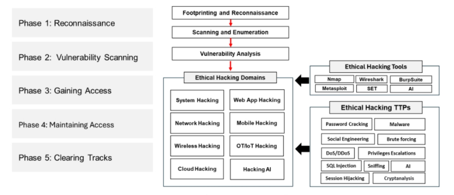
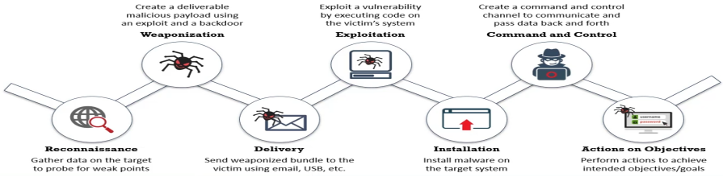

El marco de hacking ético CEH del EC-Council define el proceso paso a paso para realizar hacking ético. El marco de hacking ético CEH sigue el mismo proceso que el de un atacante, y las únicas diferencias radican en sus objetivos y estrategias de hacking.

#### ▪ Phase 1: Reconnaissance
Fase preparatoria, en la que un atacante reúne toda la información posible sobre el objetivo antes de lanzar un ataque. En esta fase, el atacante crea un perfil de la organización objetivo y obtiene información como su rango de direcciones IP, espacio de nombres y empleados

#### ▪ Phase 2: Vulnerability Scanning
La evaluación de vulnerabilidades es el examen de la capacidad de un sistema o aplicación, incluidos sus procedimientos y controles de seguridad actuales, para resistir una agresión. Reconoce, mide y clasifica las vulnerabilidades de seguridad en sistemas informáticos, redes y canales de comunicación

#### ▪Phase 3: Gaining Access
La obtención de acceso se refiere al punto en el que el atacante obtiene acceso al sistema operativo (SO) o a las aplicaciones de un ordenador o red. Las posibilidades de que un hacker obtenga acceso a un sistema objetivo dependen de varios factores, como la arquitectura y la configuración del sistema objetivo, el nivel de habilidad del autor y el nivel inicial de acceso obtenido. Una vez que un atacante obtiene acceso al sistema objetivo, intenta escalar privilegios para obtener el control total. En este proceso, también comprometen los sistemas intermedios conectados a él.

### Escalating Privileges
Tras obtener acceso a un sistema utilizando una cuenta de usuario con pocos privilegios, el atacante puede intentar aumentar sus privilegios hasta el nivel de administrador para realizar operaciones protegidas del sistema y poder pasar al siguiente nivel de la fase de pirateo del sistema, que es la ejecución de aplicaciones. El atacante explota vulnerabilidades conocidas del sistema para escalar privilegios de usuario

#### ▪ Phase 4: Maintaining Access

Mantener el acceso se refiere a la fase en la que un atacante intenta retener la propiedad del sistema. Una vez que un atacante obtiene acceso al sistema objetivo con privilegios de administrador o de nivel raíz (por tanto, propietario del sistema), puede utilizar tanto el sistema como sus recursos a voluntad. El atacante puede utilizar el sistema como plataforma de lanzamiento para explorar y explotar otros sistemas o mantener un perfil bajo y continuar la explotación. Los atacantes pueden cargar, descargar o manipular datos, aplicaciones y configuraciones en el sistema de su propiedad y también utilizar software malicioso para transferir nombres de usuario, contraseñas y cualquier otra información almacenada en el sistema.

#### ▪ Phase 5 Clearing Tracks
Para pasar desapercibidos, es importante que los atacantes borren del sistema todas las pruebas de que han comprometido la seguridad. Para conseguirlo, pueden modificar o borrar los registros del sistema utilizando ciertas utilidades de borrado de registros, eliminando así todas las pruebas de su presencia. 

#### Cyber Kill Chain Methodology

La metodología de la "ciber kill chain" es un componente de la defensa impulsada por inteligencia para la identificación y prevención de actividades de intrusión maliciosa.  
También proporciona una mayor comprensión de las fases del ataque, lo que ayuda a entender las TTPs (Tácticas, Técnicas y Procedimientos) del adversario.

### 🔎 Reconnaissance
###### Recopilar datos sobre el objetivo para buscar puntos débiles
### 🐛 Weaponization
##### "Crear una carga maliciosa entregable utilizando un exploit y una puerta trasera"

### ✉️ Delivery
##### "Enviar el paquete malicioso al objetivo utilizando correo electrónico, USB, etc."

### 💻 Exploitation
 
##### "Explotar una vulnerabilidad ejecutando código en el sistema de la víctima"

### ⬇️ Installation

##### "Instalar malware en el sistema objetivo"

### 🎮 Command and Control

##### "Crear un canal de comando y control para comunicarse y transferir datos de ida y vuelta"
#### Exploit

Un exploit (del verbo inglés to exploit, que significa "usar algo para beneficio propio") es una pieza de software, un fragmento de datos o una secuencia de comandos que se aprovecha de un error o vulnerabilidad para provocar un comportamiento no deseado o imprevisto en el software, hardware o algo electrónico (generalmente computarizado).

#### Footprinting o Reconnaissance

También conocida como reconocimiento es la técnica utilizada para recopilar información sobre los sistemas informáticos y las entidades a las que pertenecen.

#### Password cracking

En criptoanálisis y seguridad informática, el descifrado de contraseñas es el proceso de recuperación de contraseñas de datos que han sido almacenados o transmitidos por un sistema informático en forma codificada. Un enfoque común (ataque de fuerza bruta) es intentar repetidamente adivinar la contraseña y compararlas con un hash criptográfico disponible de la contraseña.
### Privilege escalation
La escalada de privilegios es el acto de explotar un error, un defecto de diseño o un descuido de configuración en un sistema operativo o aplicación de software para obtener un acceso elevado a los recursos que normalmente están protegidos de una aplicación o usuario.

#### Vulnerability assessment

Es el proceso de **identificar, analizar y priorizar las vulnerabilidades** (debilidades de seguridad) presentes en sistemas informáticos, redes, aplicaciones y otros componentes de TI.
Una evaluación de vulnerabilidades busca responder a estas preguntas:

- ¿Qué vulnerabilidades existen en el sistema?
    
- ¿Qué tan graves son?
    
- ¿Cómo podrían ser explotadas?
    
- ¿Qué se puede hacer para mitigarlas?

##### MITRE ATT&CK Framework

 **https://attack.mitre.org**

1. **MITRE ATT&CK** **Es una base de conocimientos accesible globalmente sobre las tácticas y técnicas de los adversarios, basada en observaciones del mundo real.**

2. The ATT&CK knowledge base se utiliza como base para el desarrollo de modelos de amenazas específicos y metodologías en el sector privado, el gobierno y la comunidad de productos y servicios de ciberseguridad

:TiDiamond: **Diamond Model of Intrusion Analysis**

Este modelo ofrece un marco de trabajo y un conjunto de procedimientos para reconocer grupos de eventos correlacionados en cualquiera de los sistemas de una organización. El modelo determina el elemento atómico vital que ocurre en cualquier actividad de intrusión y se conoce como el evento Diamond.
