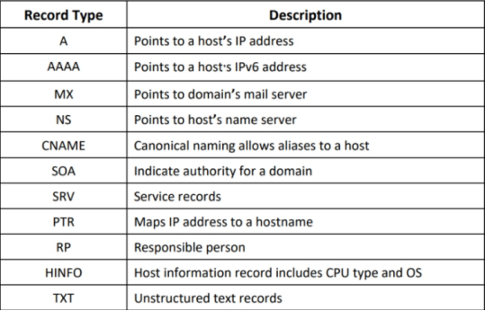

Los atacantes realizan **footprinting DNS** para recopilar información sobre los servidores DNS, registros DNS y los tipos de servidores utilizados por la organización objetivo. Esta información ayuda a los atacantes a identificar los hosts conectados en la red objetivo y a explotar aún más la organización objetivo

**DNS Interrogation Tools** 
**▪ SecurityTrails Source:** https://securitytrails.com
SecurityTrails es una herramienta avanzada de enumeración de DNS capaz de crear un mapa DNS de la red del dominio objetivo. Puede enumerar registros DNS actuales e históricos, como A, AAAA, NS, MX, SOA y TXT, lo que facilita la creación de la estructura DNS. También enumera todos los subdominios existentes del dominio objetivo mediante técnicas de fuerza bruta.

**▪ Fierce 
Source:** https://github.com
Fierce es una herramienta de reconocimiento de DNS que se utiliza para escanear y recopilar información crucial sobre el dominio objetivo. Los atacantes pueden usar esta herramienta para enumerar subdominios relacionados con el dominio objetivo. También les permite identificar espacios IP no contiguos y nombres de host vinculados a dominios o subdominios específicos.