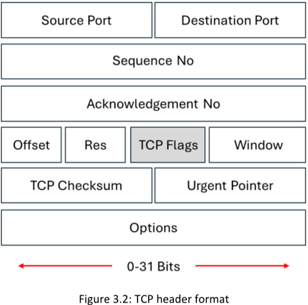
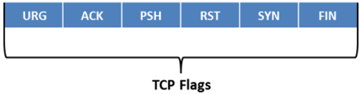

#### **TCP Communication Flags** 

▪ **Synchronize o “SYN”**:
==Notifica la transmisión de un nuevo número de secuencia. Este flag generalmente representa el establecimiento de una conexión (proceso de _three-way handshake_) entre dos hosts.==

▪ **Acknowledgement o “ACK”**:
==Confirma la recepción de la transmisión e identifica el siguiente número de secuencia esperado==. Cuando el sistema recibe con éxito un paquete, establece el valor de este flag en “1”, lo que implica que el receptor debe prestarle atención.

▪ **Push o “PSH”**: 
Cuando se establece en “1”, ==indica que el emisor ha activado la operación de _push_ hacia el receptor; esto implica que el sistema remoto debe informar a la aplicación receptora sobre los datos almacenados en búfer que provienen del emisor==. El sistema activa el flag PSH al inicio y al final de la transferencia de datos, y lo establece en el último segmento de un archivo para evitar bloqueos de búfer.

▪ **Urgent o “URG”**:
==Indica al sistema que procese los datos contenidos en los paquetes lo antes posible. Cuando el sistema establece este flag en “1”, se da prioridad al procesamiento de los datos urgentes== y se detiene el procesamiento de los demás datos.

▪ **Finish o “FIN”**: 
Se establece en “1” ==para anunciar que no se enviarán más transmisiones al sistema remoto y que se termina la conexión establecida por el flag SYN.==

▪ **Reset o “RST”**:
==Cuando hay un error en la conexión actual, este flag se establece en “1” y la conexión se aborta como respuesta al error.== Los atacantes utilizan este flag para escanear hosts e identificar puertos abiertos.
