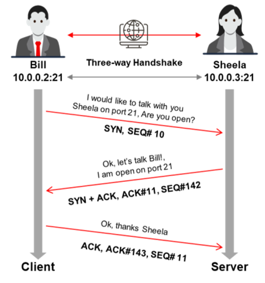
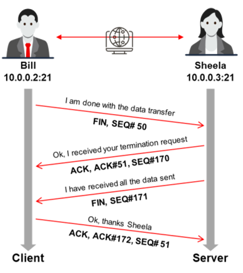

==TCP es orientado a la conexión, es decir, prioriza el establecimiento de la conexión antes de la transferencia de datos entre aplicaciones.== Esta conexión entre protocolos es posible a través del apretón de manos de tres vías.

Una sesión TCP se inicia utilizando un mecanismo de apretón de manos de tres vías:  
▪ Para iniciar una conexión TCP, la fuente (10.0.0.2:21) envía un paquete **SYN al** destino (10.0.0.3:21).  
▪ Al recibir el paquete **SYN,** el destino responde enviando un paquete **SYN/ACK** de vuelta a la fuente.  
▪ El paquete **ACK** confirma la llegada del primer paquete **SYN** a la fuente.

▪ Finalmente, la fuente envía un paquete **ACK para el paquete ACK/SYN** transmitido por el destino.  
▪ Esto desencadena una conexión "ABIERTO", lo que permite la comunicación entre la fuente y el destino, la cual continuará hasta que uno de ellos emita un paquete **"FIN" o "RST"** para cerrar la conexión.

#### **The system terminates the established TCP session as follows:**

