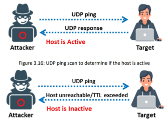
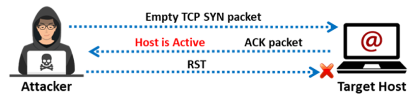

#### **Host Discovery Techniques**

**Escaneo ARP Ping**

==En el escaneo ARP ping, se envían paquetes ARP para descubrir todos los dispositivos activos en el rango de direcciones IPv4, incluso si la presencia de dichos dispositivos está oculta por firewalls restrictivos==. El escaneo ARP se utiliza para mostrar la dirección MAC de la interfaz de red en el dispositivo, y también puede mostrar las direcciones MAC de todos los dispositivos que comparten la misma dirección IPv4 en la red LAN.

**In Zenmap, the -PR option is used to perform ARP ping scan.**

==**nmap -sn -PR target**==

**Nota**:  **-sn** es el comando de Nmap que **se utiliza para deshabilitar el escaneo de puertos**. Dado que Nmap utiliza el escaneo ARP ping como el escaneo de ping predeterminado, para deshabilitarlo y realizar otros tipos de escaneo de ping que desees,puedes usar la opción --disable-arp-ping.

**Escaneo UDP Ping**

El escaneo UDP ping es similar al escaneo TCP ping; sin embargo, en el escaneo UDP ping, Nmap envía paquetes UDP al host de destino. El número de puerto predeterminado que utiliza Nmap para el escaneo UDP ping es el 40,125. Este puerto, poco común, se usa por defecto para enviar paquetes UDP al objetivo.

| **nmap -sn -PU target** |  |
| ----------------------- | ------------------------------------------------- |

**Escaneo ICMP ECHO Ping**

El escaneo ICMP ECHO ping consiste en enviar solicitudes ICMP ECHO a un host. ==Si el host está activo, responderá con una respuesta ICMP ECHO. Este tipo de escaneo es útil para localizar dispositivos activos o para determinar si el tráfico ICMP está atravesando un firewall.==

**Esta técnica no funciona en redes basadas en Windows**.==Nmap utiliza la opción -P para realizar un escaneo ICMP al objetivo==. El usuario también puede aumentar el número de pings en paralelo usando la opción -L. Además, puede ser útil ajustar el valor de tiempo de espera de los pings usando la opción -T.

**nmap -sn -PE target**

**ICMP ECHO Ping Sweep**

==Un ping sweep (también conocido como barrido ICMP) es una técnica básica de escaneo de red que se utiliza para determinar el rango de direcciones IP que corresponden a hosts activos (computadoras).==

Aunque un solo ping puede indicar si un host específico existe en la red, un ping sweep consiste en enviar solicitudes ICMP ECHO a múltiples hosts. Si un host especificado está activo, responderá con una respuesta ICMP ECHO.

**nmap -sn -PE** **target** **10.10.1.5-24**

**Escaneo ICMP Timestamp Ping**

El ping ICMP con marca de tiempo (ICMP Timestamp Ping) ==es un tipo de ping ICMP opcional y adicional, mediante el cual los atacantes envían una solicitud de marca de tiempo para obtener información relacionada con la hora actual del sistema de la máquina objetivo==.Este tipo de escaneo puede ser útil para detectar hosts activos y, además, obtener detalles sobre su configuración horaria o incluso inferir tiempo de actividad del sistema.

**nmap -sn -PP** **target** **10.10.1.5**

**Escaneo ICMP Address Mask Ping**

El ping ICMP con máscara de dirección (ICMP Address Mask Ping) es una alternativa al tradicional ping ICMP ECHO. ==En este tipo de escaneo, los atacantes envían una solicitud ICMP de máscara de dirección al host de destino con el objetivo de obtener información relacionada con su máscara de subred.==

==Este método puede ser utilizado para recopilar datos adicionales sobre la configuración de red del objetivo, aunque muchos sistemas modernos ya no responden a este tipo de solicitudes por motivos de seguridad.==

**nmap -sn -PM** **target** **10.10.1.5**

**TCP SYN Ping Scan**

==El TCP SYN ping es una técnica de descubrimiento de hosts que se utiliza para sondear diferentes puertos y determinar si están en línea, así como para identificar si existen reglas de firewall activas.==

En esta técnica, un atacante utiliza la herramienta Nmap para iniciar el handshake de tres vías, enviando un paquete TCP con la bandera SYN al host objetivo. **Si el host está activo, responderá con un paquete ACK, indicando que ha recibido la solicitud. Al recibir el ACK, el atacante confirma que el host está activo y luego finaliza la conexión enviando un paquete RST (Reset) al objetivo.**

El puerto 80 se utiliza como puerto de destino por defecto para este tipo de escaneo.

| **nmap -sn -PS 10.10.1.5** |  |
| :------------------------- | ------------------------------------------------: |

**TCP ACK Ping Scan**

El TCP ACK ping es similar al TCP SYN ping, aunque con algunas variaciones. También utiliza el puerto 80 por defecto.

==En esta técnica, el atacante envía un paquete TCP ACK vacío directamente al host de destino, sin haber establecido previamente una conexión. Dado que no existe una sesión activa, el host de destino responde con un paquete RST (Reset) para finalizar la solicitud.==

==**La recepción del paquete RST por parte del atacante indica que el host está activo.**==

**nmap -sn -PA 10.10.1.5**

**IP Protocol Ping Scan**

El ping de protocolo IP es la última opción de descubrimiento de hosts que envía paquetes de ping IP con el encabezado IP de cualquier número de protocolo especificado. Tiene el mismo formato que el ping TCP y UDP. Esta técnica intenta enviar diferentes paquetes utilizando diferentes protocolos IP, con la esperanza de obtener una respuesta que indique que un host está en línea. De forma predeterminada, se envían múltiples paquetes IP para ICMP (protocolo 1), IGMP (protocolo 2) e IP-in-IP (protocolo 4) cuando no se especifican protocolos.

**nmap -sn -PO 10.10.1.5**

#### **Herramientas de Ping Sweep**  
▪ Angry IP Scanner Fuente: [https://angryip.org](https://angryip.org)

Angry IP scanner es un escáner de direcciones IP y puertos. Puede escanear direcciones IP en cualquier rango, así como cualquiera de sus puertos. Hace ping a cada dirección IP para comprobar si está activa; luego, opcionalmente resuelve su nombre de host, determina la dirección MAC, escanea puertos, etc.

**Some additional ping sweep tools that an attacker uses to determine live hosts on the target network are listed below:** 

▪ SolarWinds Engineer’s Toolset (https://www.solarwinds.com) 
▪ NetScanTools Pro (https://www.netscantools.com) 
▪ Colasoft Ping Tool (https://www.colasoft.com)
▪ Advanced IP Scanner (https://www.advanced-ip-scanner.com) 
▪ OpUtils (https://www.manageengine.com)
