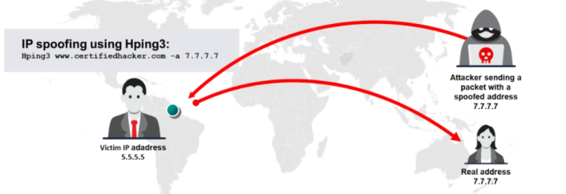

##### **Packet Fragmentation**  
La fragmentación de paquetes ==se refiere a la división de un paquete de sondeo en varios paquetes más pequeños (fragmentos) al enviarlo a una red. Cuando estos paquetes llegan a un host, los IDS y firewalls detrás del host generalmente los ponen en cola y los procesan uno por uno. Sin embargo, dado que este método de procesamiento implica un mayor consumo de recursos de CPU y red, la configuración de la mayoría de los IDS hace que omitan los paquetes fragmentados durante los escaneos de puertos.==

**SYN/FIN Scanning Using IP Fragments**

En este escaneo, el sistema divide el encabezado TCP en varios fragmentos y los transmite a través de la red. Sin embargo, la reensambladura de IP en el lado del servidor puede resultar en resultados impredecibles y anormales, como la fragmentación de los datos del encabezado de IP.

**nmap -sS -T4 -A -f -v 10.10.1.11**

| -f  | Frafmenta los paquetes         |     |     |
| --- | ------------------------------ | --- | --- |
| -sS | SYN scan                       |     |     |
| -A  | Agresive scan                  |     |     |
| -T4 | nivel de velocidad del escaneo |     |     |

**Source Routing**

En algunos casos, los routers en el camino pueden incluir firewalls e IDS configurados que bloquean dichos paquetes. Para evitarlos, los atacantes aplican un mecanismo de enrutamiento de origen flexible o estricto, en el que manipulan la ruta de direcciones IP en el campo de opciones IP, de manera que el paquete siga la ruta definida por el atacante (sin los routers configurados con firewall/IDS) para llegar al destino, eludiendo así firewalls e IDS.

**Source Port Manipulation**

Generalmente, el administrador configura el firewall permitiendo el tráfico entrante desde puertos bien conocidos como HTTP, DNS, FTP, etc. El firewall puede simplemente permitir el tráfico entrante de los paquetes enviados por los atacantes utilizando esos puertos comunes. El atacante intenta manipular el número de puerto original con estos puertos comunes, lo que puede eludir fácilmente el IDS/firewall.

**nmap -g 80 10.10.1.11 (-g especifica el puerto de origen)**

**IP Address Decoy**

You can perform two types of decoy scans using Nmap:

 ▪ **nmap -D RND:10 [target]** 

Using this command, Nmap automatically generates a random number of decoys for the scan and randomly positions the real IP address between the decoy IPs.

**nmap -D RND: 10 10.10.1.11** 

You can manually specify the IP addresses of the decoys to scan the victim’s network.

**nmap -D 192.168.0.1,172.120.2.8,192.168.2.8,10.10.1.19,10.10.1.5 10.10.1.11**

**Suplantación de dirección IP (IP Address Spoofing)**
La suplantación de dirección IP es una técnica de secuestro en la que un atacante obtiene la dirección IP de una computadora, modifica los encabezados de los paquetes y envía paquetes de solicitud a una máquina objetivo, haciéndose pasar por un host legítimo.

==**Nota: No podrás completar el protocolo de enlace de tres vías ni establecer una conexión TCP exitosa utilizando direcciones IP suplantadas.**==

**IP spoofing using Hping3:**

**Hping3 www.certifiedhacker.com -a 7.7.7.7**

##### **Suplantación de dirección MAC (MAC Address Spoofing)**

Realización de suplantación de MAC para escanear más allá del IDS y el firewall usando Nmap:  
Los atacantes utilizan la opción --spoof-mac de Nmap para elegir o establecer una dirección MAC específica en los paquetes que envían al sistema o red objetivo.

**▪ nmap -sT -Pn --spoof-mac 0 [Target IP]**  

**-spoof-mac 0 represents the randomization of the MAC address.**

**nmap -sT -Pn --spoof-mac 0 10.10.1.11**  

**▪ nmap -sT -Pn --spoof-mac [Vendor] [Target IP]**

  **--spoof-mac [vendor] represents the randomization of the MAC address based on the specified vendor.**

**nmap -sT -Pn --spoof-mac Dell 10.10.1.11**  

**▪ nmap -sT -Pn --spoof-mac [new MAC] [Target IP]**

 **--spoof-mac [new MAC] represents manually setting the MAC address.**

**nmap -sT -Pn --spoof-mac 00:01:02:25:56:AE 10.10.1.11**  

##### **Creating Custom Packets**

**==Colasoft Packet Builder==**
Colasoft Packet Builder es una herramienta que permite al atacante crear paquetes de red personalizados y también ayuda a los profesionales de seguridad a evaluar la red. El atacante puede seleccionar un paquete TCP desde las plantillas disponibles y modificar sus parámetros utilizando el editor en modo decodificador, hexadecimal o ASCII para construir el paquete deseado.

**Randomizing Host Order and Sending Bad Checksums**

El atacante escanea la cantidad de hosts en la red objetivo en un orden aleatorio para evitar patrones predecibles y dificultar la detección por parte de firewalls o sistemas de detección de intrusos (IDS). Esto también permite ocultar mejor cuál es el verdadero objetivo entre muchos escaneados.

**nmap --randomize-hosts -sS -p 80 10.10.1.0/24**

##### **Envío de Sumas de Verificación Incorrectas (Bad Checksums)**

**El atacante envía paquetes con sumas de verificación TCP/UDP defectuosas o falsas al objetivo previsto para evadir ciertas reglas de firewall**.Las sumas de verificación (checksums) TCP/UDP se utilizan para garantizar la integridad de los datos.Enviar paquetes con checksums incorrectos puede ayudar a los atacantes a obtener información de sistemas mal configurados observando si se recibe alguna respuesta.

**nmap --badsum -sS -p 80 10.10.1.0/24**

**Encadenamiento de Proxies (Proxy Chaining)**

El encadenamiento de proxies ayuda a un atacante a aumentar su anonimato en Internet.  
El nivel de anonimato en línea depende del número de servidores proxy utilizados para acceder a la aplicación objetivo; cuanto mayor sea el número de proxies en la cadena, mayor será el anonimato del atacante.

**Herramientas de Proxy (Proxy Tools)**

Las herramientas de proxy están destinadas a permitir a los usuarios navegar por Internet de forma anónima manteniendo su IP oculta a través de una cadena de proxies SOCKS o HTTP. Estas herramientas también pueden actuar como servidores proxy HTTP, de correo, FTP, SOCKS, noticias, telnet y HTTPS.

▪ **Proxy Switcher**  
**Fuente:** [https://www.proxyswitcher.com](https://www.proxyswitcher.com)
Proxy Switcher permite a los atacantes navegar por Internet de forma anónima sin revelar su dirección IP.

**▪ CyberGhost VPN 
Source:** https://www.cyberghostvpn.com

**Some additional proxy tools are listed below:** 
▪ Burp Suite (https://www.portswigger.net) 
▪ Tor (https://www.torproject.org) 
▪ Hotspot Shield (https://www.hotspotshield.com) 
▪ Proxifier (https://www.proxifier.com) 
▪ IPRoyal Residential Proxy (https://iproyal.com)

**Anonymizers / Anonimizadores**
==Un anonimizador es un servidor intermedio colocado entre un usuario final y un sitio web, que accede al sitio web en su nombre y hace que las actividades de navegación web sean imposibles de rastrear==. Los anonimizadores permiten a los usuarios eludir la censura en Internet. Un anonimizador elimina toda la información identificable (dirección IP) del sistema mientras se navega por Internet, asegurando así la privacidad.

**Types of Anonymizers**

 **▪ Networked Anonymizers; 
 ▪ Single-Point Anonymizers**

##### **Anonymizer tools** 

▪ **Whonix**  
**Fuente:** [https://www.whonix.org](https://www.whonix.org)

Whonix es un sistema operativo de escritorio diseñado para ofrecer seguridad y privacidad avanzadas. Mitiga la amenaza de vectores de ataque comunes mientras mantiene la usabilidad. La anonimidad en línea se logra mediante el uso de la red Tor de forma segura, automática y a nivel de todo el sistema de escritorio.

**Some additional anonymizers are listed below:** 
▪ Psiphon (https://psiphon.ca) 
▪ TunnelBear (https://www.tunnelbear.com) 
▪ Invisible Internet Project (I2P) (https://geti2p.net) 
▪ Bright Data Proxy API (https://brightdata.com)

**Herramientas para la evasión de la censura**

▪ **AstrillVPN**  
**Fuente:** [https://www.astrill.com](https://www.astrill.com)

AstrillVPN es un software de VPN que permite a los atacantes evadir la censura en Internet y acceder a sitios web, aplicaciones y servicios con restricciones geográficas, ocultando su dirección IP y ubicación.

==▪ **Tails**==  
**Fuente:** [https://tails.net](https://tails.net)

Tails es un sistema operativo en vivo que los usuarios pueden ejecutar en cualquier computadora desde una memoria USB o una tarjeta SD. Utiliza herramientas criptográficas de última generación para cifrar archivos, correos electrónicos y mensajes instantáneos. Permite a los atacantes usar Internet de forma anónima y eludir la censura. No deja ningún rastro en la computadora.

