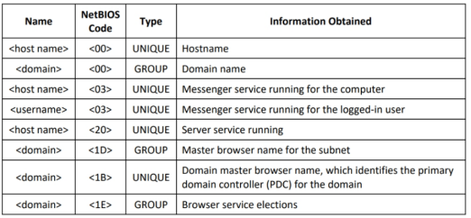
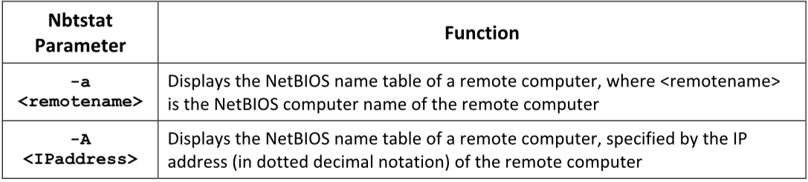
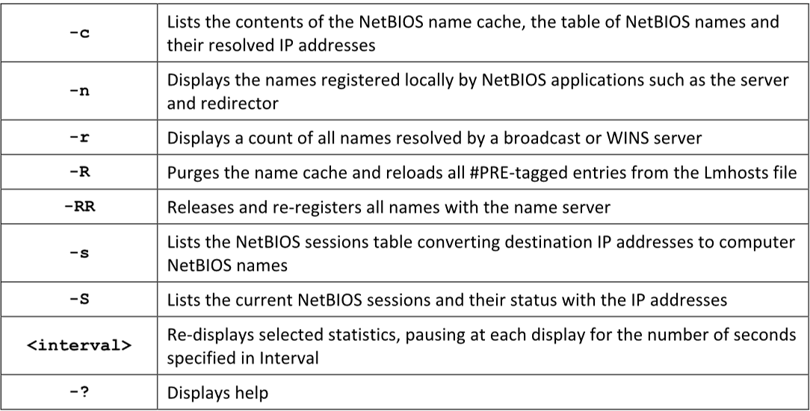

**Enumeración de NetBIOS (NetBIOS Enumeration)**
Los atacantes utilizan la enumeración de NetBIOS para obtener lo siguiente:  
▪ La lista de computadoras que pertenecen a un dominio  
▪ La lista de recursos compartidos en los hosts individuales de una red  
▪ Políticas y contraseñas

Un atacante que encuentra un sistema Windows con el puerto 139 abierto puede verificar qué recursos se pueden acceder o visualizar en un sistema remoto.
**Note** that Microsoft does **not support NetBIOS** name resolution for **IPv6**



|                    |          |                                                                                                                                       |
| ------------------ | -------- | ------------------------------------------------------------------------------------------------------------------------------------- |
| **Código NetBIOS** | **Tipo** | **Descripción**                                                                                                                       |
| <00>               | UNIQUE   | Nombre del **equipo (hostname)**. Indica el nombre de la máquina en la red.                                                           |
| <00>               | GROUP    | Nombre del **dominio o grupo de trabajo**. Identifica el dominio al que pertenece el equipo.                                          |
| <03>               | UNIQUE   | **Servicio de mensajería (Messenger Service)** asociado al **nombre del equipo**. Indica que el servicio está activo en la máquina.   |
| <03>               | UNIQUE   | **Servicio de mensajería asociado al usuario** (si hay una sesión iniciada).                                                          |
| <20>               | UNIQUE   | **Servicio de servidor (Server Service)**. Indica que el equipo comparte recursos (archivos, impresoras, etc.).                       |
| <1D>               | GROUP    | **Maestro navegador local (Master Browser)**. Identifica qué equipo actúa como "maestro" para listar dispositivos en la red (subred). |
| <1B>               | UNIQUE   | **Controlador Principal de Dominio (PDC, Primary Domain Controller)**. Solo aparece en el PDC de un dominio Windows antiguo (NT).     |
| <1E>               | GROUP    | **Elecciones del servicio de navegación (Browser Elections)**. Usado en el proceso de selección del "maestro navegador".              |

**Utilidad Nbtstat**  
Fuente: [https://learn.microsoft.com](https://learn.microsoft.com)

Nbtstat es una utilidad de Windows que ayuda a solucionar problemas de resolución de nombres **NETBIOS**. El comando `nbtstat` elimina y corrige entradas precargadas utilizando varios modificadores sensibles a mayúsculas y minúsculas.

Los atacantes utilizan **Nbtstat** para enumerar información como:

- Estadísticas del protocolo **NetBIOS sobre TCP/IP (NetBT)**,    
- Tablas de nombres NetBIOS tanto de equipos locales como remotos,    
- Y la caché de nombres NetBIOS.

The syntax of the nbtstat command is as follows: 

```
nbtstat [-a <remotename>] [-A <IPaddress>] [-c] [-n] [-r] [-R] [-RR] [-s] [-S] [<interval>][-?]
```




#### **Examples for nbtstat commands.** 


“nbtstat –a  \<IP address of the remote machine\>"

To obtain the contents of the NetBIOS name cache, 
nbtstat –c 

**NetBIOS Enumeration Tools**

**▪ NetBIOS Enumerator**
Source: https://nbtenum.sourceforge.net 
**NetBIOS Enumerator** es una herramienta de enumeración que muestra cómo utilizar el soporte de red remota y cómo manejar algunos otros protocolos web, como **SMB**.


**▪ Nmap 
Source:** https://nmap.org
nmap -sV -v --script nbstat.nse \<target IP address\>

The following are some additional NetBIOS enumeration tools:
▪ Global Network Inventory (https://magnetosoft.com ) 
▪ Advanced IP Scanner (https://www.advanced-ip-scanner.com) 
▪ Hyena (https://www.systemtools.com) 
▪ Nsauditor Network Security Auditor (https://www.nsauditor.com)

**Enumerating User Accounts** 
**Source**: https://learn.microsoft.com 
La enumeración de cuentas de usuario utilizando la suite **PsTools** ayuda a controlar y gestionar sistemas remotos desde la línea de comandos

**▪ PsExec** 
**PsExec** es una alternativa liviana a Telnet que puede ejecutar procesos en otros sistemas, con interactividad completa para aplicaciones de consola, sin necesidad de instalar software cliente manualmente.

▪ **PsFile**  
PsFile es una utilidad de línea de comandos que muestra una lista de archivos en un sistema que han sido abiertos de forma remota, y también puede cerrar archivos abiertos ya sea por nombre o mediante un identificador de archivo.

▪ **PsGetSid**  
**PsGetSid** traduce SIDs (Identificadores de Seguridad) a sus nombres visibles y viceversa. Funciona con cuentas integradas, cuentas de dominio y cuentas locales.

▪ **PsKill**  
**PsKill** es una utilidad para finalizar procesos que puede **terminar procesos en sistemas remotos** así como también **procesos en la computadora local**.

▪ **PsInfo**  
**PsInfo** es una herramienta de línea de comandos que recopila información clave sobre sistemas Windows locales o remotos (especialmente versiones anteriores), incluyendo:

- El tipo de instalación    
- La versión del kernel    
- La organización y el propietario registrados

▪ **PsList**  
**PsList** es una herramienta de línea de comandos que muestra información sobre la **unidad central de procesamiento (CPU)**, el **uso de memoria**, o **estadísticas de hilos** (threads).

▪ **PsLoggedOn**  
**PsLoggedOn** es una pequeña aplicación que muestra tanto los usuarios conectados localmente como aquellos conectados a través de recursos, ya sea en la computadora local o en una remota.

#### **Enumerating Shared Resources Using Net View** 
**Net View es una utilidad de línea de comandos que muestra una lista de computadoras en un grupo de trabajo especificado o los recursos compartidos disponibles en una computadora especificada. Se puede usar de las siguientes maneras:

**net view**  **\\\\ \<computername\>**

**net view \\\\ \<computername\> /ALL**

The above command displays all the shares on the specified remote computer
**net view /domain**

The above command displays all the shares in the domain. 
**net view /domain:\<domain name\>** 
