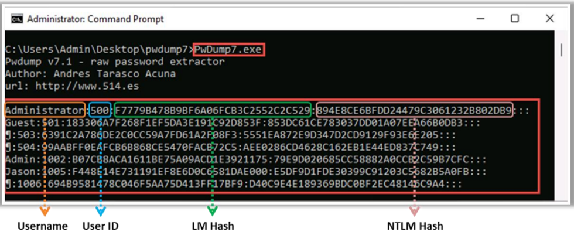

#### Cracking Passwords 
##### ▪ Security Accounts Manager (SAM) Database 
Windows utiliza la base de datos **Security Accounts Manager (SAM)** o la base de datos de **Active Directory** para gestionar cuentas de usuario y contraseñas en formato hash (hash unidireccional)==,específicamente usando los algoritmos **LM (LAN Manager)** o **NTLM (NT LAN Manager)**==. ==El sistema **no almacena las contraseñas en texto plano**, sino en formato hash para protegerlas contra ataques.==
No es posible copiar el archivo **SAM** a otra ubicación en el caso de ataques en línea. Esto se debe a que el sistema bloquea el archivo SAM con un **bloqueo exclusivo del sistema de archivos**. ==Este bloqueo no se libera hasta que el sistema presenta una **excepción de pantalla azul (BSOD)** o el sistema operativo se apaga por completo.== Sin embargo, para **hacer disponibles los hashes de contraseñas** para ataques de fuerza bruta **offline**, los atacantes pueden **volcar el contenido del archivo SAM en disco** usando diversas técnicas.
- **Ubicación del archivo SAM:**  
    `%SystemRoot%\system32\config\SAM`  
    (normalmente en `C:\Windows\System32\config\SAM`)
    
- **Registro del sistema:**  
    Windows monta este archivo en el registro bajo la clave:  
    `HKEY_LOCAL_MACHINE\SAM`
#### ▪ NTLM Authentication 
**NT LAN Manager (NTLM)** es un esquema de autenticación predeterminado que realiza la autenticación utilizando una estrategia de **desafío/respuesta**. Dado que no se basa en ninguna especificación oficial de protocolo, **no se garantiza que funcione eficazmente en todas las situaciones**. Sin embargo, ha sido utilizado en algunas instalaciones de Windows donde ha funcionado con éxito.  
La autenticación NTLM consta de dos protocolos: el **protocolo de autenticación NTLM** y el **protocolo de autenticación LAN Manager (LM)**. Estos protocolos utilizan **diferentes métodos de hash** para almacenar las contraseñas de los usuarios en la base de datos SAM.

#### ▪ Kerberos Authentication
**Kerberos** es un protocolo de autenticación de red que proporciona **autenticación robusta** para aplicaciones cliente/servidor mediante **criptografía de clave secreta**. Este protocolo ofrece **autenticación mutua**, lo que significa que tanto el servidor como el usuario verifican la identidad del otro.
Los mensajes enviados a través del protocolo Kerberos están protegidos contra **ataques de repetición y espionaje**. Kerberos emplea el **Centro de Distribución de Claves (KDC)**, que es un tercero de confianza compuesto por dos partes lógicamente distintas: un **servidor de autenticación (AS)** y un **servidor de concesión de tickets (TGS)**.  
Kerberos utiliza **"tickets"** para demostrar la identidad del usuario.  
Microsoft ha actualizado su protocolo de autenticación predeterminado a Kerberos, ya que ofrece **una autenticación más sólida** para aplicaciones cliente/servidor que NTLM.

#### Tools to Extract the Password Hashes 
**▪ pwdump7**  
**Fuente:** [https://www.tarasco.org](https://www.tarasco.org)

Es una aplicación que extrae los hashes de contraseñas (funciones unidireccionales u OWF) desde la base de datos SAM de NT. Extrae los hashes de contraseñas LM y NTLM de las cuentas de usuario locales desde la base de datos del Administrador de Cuentas de Seguridad (SAM). Esta aplicación o herramienta funciona extrayendo los archivos binarios SAM y SYSTEM del sistema de archivos, y luego extrae los hashes.Una de las características más potentes de pwdump7 es que también es capaz de extraer archivos protegidos. Pwdump7 también puede extraer contraseñas de forma offline al seleccionar los archivos objetivo. ==El uso de este programa requiere privilegios administrativos en el sistema remoto.==

Some of the additional tools to extract password hashes are as follows:
==▪ Mimikatz (https://github.com)== 
▪ DSInternals (https://github.com) 
▪ hashcat (https://hashcat.net) 
▪ PyCrack (https://github.com)

**Nota:** **==Los usuarios con el User ID 500 son administradores de sistema 501 invitados==**

#### Password Cracking 

El crackeo de contraseñas es el proceso de recuperar contraseñas a partir de los datos transmitidos por un sistema informático o de los datos almacenados en él. El propósito de crackear una contraseña puede ser ayudar a un usuario a recuperar una contraseña olvidada o perdida, como una medida preventiva por parte de los administradores del sistema para verificar la fortaleza de las contraseñas, o bien, para que un atacante obtenga acceso no autorizado al sistema.