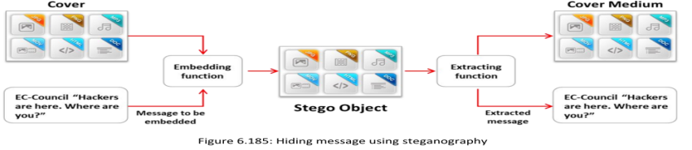
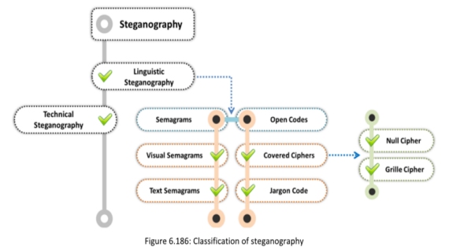

La esteganografía se refiere al arte de ocultar datos "detrás" de otros datos sin el conocimiento de la víctima. De esta manera, la esteganografía oculta la existencia de un mensaje. Reemplaza bits de datos no utilizados en archivos comunes, como gráficos, sonido, texto, audio y video, con otros bits furtivos. Los datos ocultos pueden estar en forma de texto plano o cifrado, y a veces, una imagen.

**Classification of Steganography**
**Esteganografía técnica:** En esta modalidad, un mensaje se oculta utilizando métodos científicos. Esto puede implicar el uso de técnicas computacionales, como modificar archivos de imágenes, audio o video, para insertar datos ocultos en estos archivos

**Esteganografía lingüística:** En este caso, el mensaje se oculta en un portador, que es el medio utilizado para comunicar o transferir mensajes o archivos. Este medio está compuesto por el mensaje oculto, el portador y la clave de esteganografía, que permite recuperar el mensaje oculto del portador.

**Image Steganography Tools**  

**▪ OpenStego**
▪ StegOnline (https://georgeom.net)
▪ Coagula (https://www.abc.se)
▪ SSuite Picsel (https://www.ssuitesoft.com)
▪ CryptaPix (https://www.briggsoft.com)

**Steganography Detection Tools**

**▪ zsteg**
▪ StegoVeritas (https://github.com)
▪ Stegextract (https://github.com)
▪ StegoHuntTM MP (https://www.wetstonetech.com)
▪ Steganography Studio (https://stegstudio.sourceforge.net)
▪ Virtual Steganographic Laboratory (VSL) (https://vsl.sourceforge.net)

