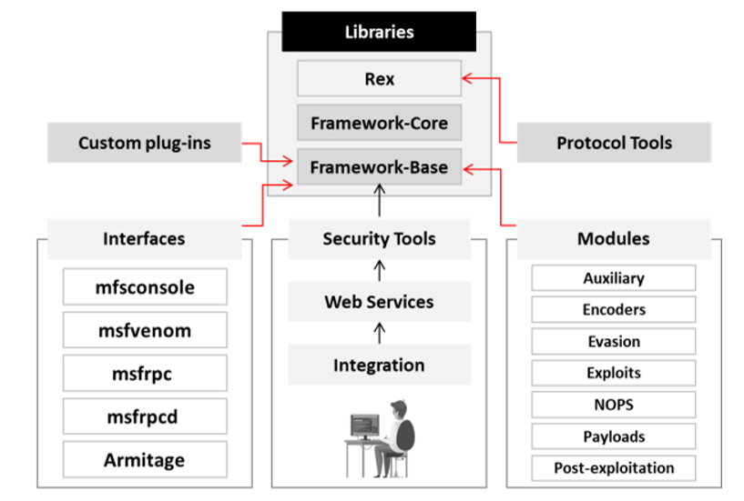

**▪ Módulo de Explotación de Metasploi**t**  
Es un módulo básico en Metasploit utilizado para encapsular un único exploit, con el cual los usuarios pueden atacar múltiples plataformas. Este módulo cuenta con campos de metainformación simplificados.

#### Herramientas de Explotación de Vulnerabilidades Impulsadas por IA  
**Nebula**  
**Fuente**: [https://github.com](https://github.com)

Nebula representa un cambio de paradigma en el hacking ético, al aprovechar las capacidades de la inteligencia artificial (IA) para revolucionar la detección y explotación de vulnerabilidades.

**DeepExploit**  
**Fuente**: [https://github.com](https://github.com)

DeepExploit utiliza un modelo de aprendizaje profundo para automatizar la identificación y explotación de vulnerabilidades. Este sistema integra el modelo de red neuronal A3C (Asynchronous Advantage Actor-Critic) para analizar y explotar de forma autónoma las vulnerabilidades en los sistemas objetivo.