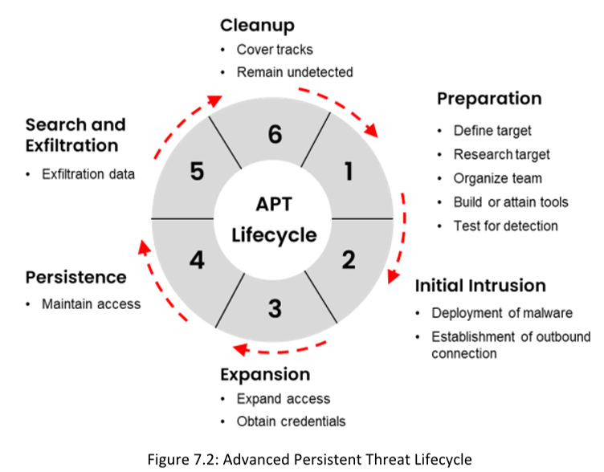

**Las Amenazas Persistentes Avanzadas (APT)** representan una grave preocupación de seguridad para cualquier organización, ya que suponen un riesgo para los activos, recursos, registros financieros y otros datos confidenciales.Los ataques APT son altamente sofisticados, combinando código malicioso con múltiples **exploits de día cero** para infiltrarse en la red objetivo.
  

**Advanced Persistent Threat Lifecycle**

