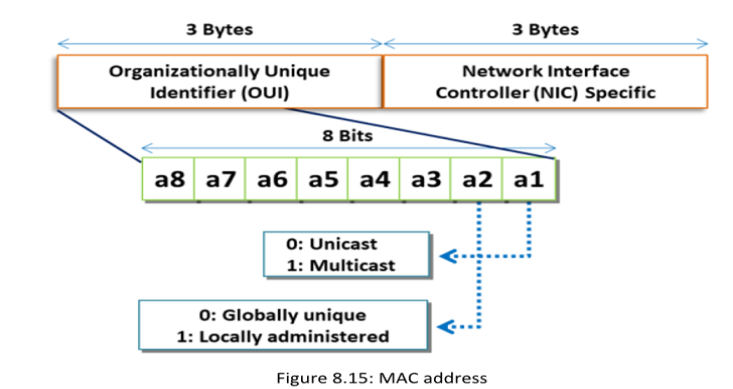
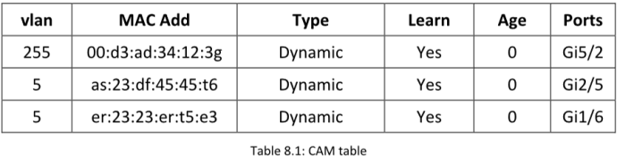

**MAC Address**

==Una dirección MAC identifica de manera única cada nodo de una red.Las direcciones MAC se utilizan como direcciones de red para la mayoría de las tecnologías de red IEEE 802, incluyendo Ethernet==.el protocolo MAC en el modelo de referencia OSI utiliza direcciones MAC para la transferencia de información.Una dirección MAC ==está compuesta por 48 bits que se dividen en dos secciones, cada una conteniendo 24 bits. La primera sección contiene el número de identificación de la organización que fabricó el adaptador y se llama el **identificador único organizacional (OUI)**==. ==La siguiente sección contiene el número de serie asignado al adaptador de la NIC (tarjeta de interfaz de red) y se llama especificación de NIC.== La dirección MAC ==contiene números hexadecimales de 12 dígitos, divididos en tres o seis grupos. Los primeros seis dígitos indican el fabricante, mientras que los siguientes seis dígitos indican el número de serie del adaptador.==

**CAM Table**

==Una tabla CAM (Content Addressable Memory) es una tabla dinámica de **tamaño fijo**. Almacena información como las direcciones MAC disponibles en los puertos físicos junto con los parámetros de VLAN asociados a ellas.Cuando una máquina envía datos a otra máquina en una red, los datos pasan a través del switch. El switch busca la dirección MAC de destino (ubicada en el marco Ethernet) en su tabla CAM, y una vez que encuentra la dirección MAC, reenvía los datos a la máquina a través del puerto con el que está vinculada esa dirección MAC.==

==**Si la tabla CAM se llena con más direcciones MAC de las que puede almacenar, el switch se comportará como un hub.**==

==**El tamaño limitado de una tabla CAM la hace susceptible a ataques de MAC flooding, que inunda el switch con direcciones MAC de origen falsas hasta que la tabla CAM se llena.**==

**MAC Flooding**
El MAC flooding es una técnica utilizada para comprometer la seguridad de los switches de red que conectan segmentos o dispositivos de red. ==Los atacantes utilizan la técnica de MAC flooding para forzar a un switch a actuar como un hub, de modo que puedan esnifar fácilmente el tráfico.==

==Un atacante puede enviar numerosas direcciones MAC falsas al switch. No ocurre ningún problema hasta que la tabla de direcciones MAC esté llena. Una vez llena, cualquier solicitud adicional puede forzar al switch a entrar en modo de fail-open.En el modo fail-open, el switch comienza a comportarse como un hub y transmite el tráfico entrante a través de todos los puertos de la red.== El atacante luego cambia la NIC de su máquina a modo promiscuo para permitir que la máquina acepte todo el tráfico entrante y asi esnifar el trafico.

**Mac Flooding Switches with macof 
Source: https://monkey.org**

##### macof -i eth0 -n 10

##### **Switch Port Stealing** 
La técnica de _sniffing_ conocida como **switch port stealing** utiliza **MAC flooding** para interceptar los paquetes. El atacante inunda el _switch_ con paquetes **ARP gratuitos falsificados**, utilizando como dirección MAC de origen la del objetivo, y como dirección MAC de destino la suya propia.
Esto genera una **condición de carrera** entre los paquetes inyectados por el atacante y los paquetes legítimos del host objetivo, lo que obliga al _switch_ a alternar constantemente la vinculación de la dirección MAC entre dos puertos diferentes.

En este escenario, si el atacante actúa con suficiente rapidez, podrá redirigir los paquetes destinados al host objetivo hacia su propio puerto del _switch_. De este modo, el atacante logra **robar el puerto del switch del host objetivo** y envía una **solicitud ARP (ARP request)** a dicho puerto para descubrir la dirección IP del host.

Cuando el atacante recibe una **respuesta ARP (ARP reply)**, esto indica que la vinculación del puerto del host en el switch ha sido restaurada, y el atacante puede **interceptar los paquetes** que se envían hacia el host objetivo.

#### **How to Defend against MAC Attacks**

La seguridad de puertos es una función que identifica y limita las direcciones MAC de las máquinas que pueden acceder al puerto.Si asignas una dirección MAC segura a un puerto seguro, entonces el puerto solo reenviará paquetes cuya dirección MAC de origen esté dentro del grupo de direcciones definidas.

Establece el número máximo de direcciones MAC seguras en el puerto 

**switchport port-security mac-address**

La seguridad de puertos (Port Security) limita el número de direcciones MAC permitidas en el puerto del switch, en este caso a una sola. Por lo tanto, cuando se detectan múltiples solicitudes MAC, se reconocen como un ataque de flooding.

Como respuesta, la seguridad de puertos bloquea el puerto automáticamente y envía una trampa SNMP (SNMP trap) para notificar del evento al sistema de gestión de red.

**Configuring Port Security on Cisco Switch Source: https://www.cisco.com**
1. **interface interface_id**
2. **switchport mode access**
3. **switchport port-security**
4. **switchport port-security maximum value**
5. **switchport port-security violation {restrict | shutdown}**
6. **switchport port-security limit rate invalid-source-mac**
7. **switchport port-security mac-address mac_address**
8. **switchport port-security mac-address sticky**
9. **end**
10. **show port-security address or** **show port-security address interface interface_id**

  **Some additional commands to configure the Cisco port security feature:**
**switchport port-security maximum {1-3072}**
**switchport port-security aging time 2**
**switchport port-security aging type inactivity**
**snmp-server enable traps port-security trap-rate 5**

#### **Sniffing Technique: DHCP Attacks**

==Un ataque DHCP es una técnica de sniffing activo utilizada por los atacantes para robar y manipular datos sensibles.==

DHCP es un protocolo cliente-servidor que proporciona una dirección IP a un host IP.  
Además de la dirección IP, el servidor DHCP también proporciona información relacionada con la configuración, como la puerta de enlace predeterminada (default gateway) y la máscara de subred (subnet mask)

#### **DHCP Starvation Attack**

==En un ataque de agotamiento DHCP, un atacante inunda el servidor DHCP enviando numerosas solicitudes DHCP y utiliza todas las direcciones IP disponibles que el servidor DHCP puede asignar. Como resultado, el servidor no puede emitir más direcciones IP, lo que lleva a un ataque de denegación de servicio (DoS). Debido a este problema, los usuarios válidos no pueden obtener ni renovar sus direcciones IP, por lo que no pueden acceder a su red. Un atacante transmite solicitudes DHCP con direcciones MAC falsificadas (spoofed) con la ayuda de herramientas como Yersinia, Hyenae y Gobbler.==

**DHCP Starvation Attack Tools**
▪ Yersinia Source: https://sourceforge.net
▪ dhcpStarvation.py (https://github.com)
▪ Metasploit (https://www.metasploit.com)
▪ Hyenae (https://sourceforge.net)
▪ DHCPig (https://github.com)

##### **Rogue DHCP Server Attack**

==Un atacante que haya agotado el espacio de direcciones IP del servidor DHCP puede configurar un servidor DHCP falso en la red, el cual no está bajo el control del administrador de la red. Este servidor DHCP falso suplanta un servidor legítimo y ofrece direcciones IP y otra información de red a otros clientes de la red, actuando como la puerta de enlace predeterminada (default gateway).==

**DHCP Attack Tools:**
▪ mitm6 (https://github.com)
▪ Ettercap (https://www.ettercap-project.org)
▪ Gobbler (https://sourceforge.net)

**Defend Against DHCP Starvation**
**▪ switchport port-security**
**▪ switchport port-security maximum 1**
**▪ switchport port-security violation restrict**
**▪ switchport port-security aging time 2**
**▪ switchport port-security aging type inactivity**
**▪ switchport port-security mac-address sticky**

**Defend Against Rogue Server Attack**
==La función DHCP snooping disponible en los switches puede mitigar los ataques de servidores DHCP falsos. Se configura en el puerto al que está conectado el servidor DHCP legítimo. DHCP snooping no permite que otros puertos en el switch respondan a los paquetes DHCP Discover enviados por los clientes. Así, incluso un atacante que logre crear un servidor DHCP falso y conectarse al switch no podrá responder a los paquetes DHCP Discover.==

**IOS Global Commands Source: https://www.cisco.com**
1. **ip dhcp snooping**
2. **ip dhcp snooping vlan number [number] | vlan {vlan range}]**
3. **ip dhcp snooping trust**
4. **ip dhcp snooping limit rate**
5. **end**
6. **show ip dhcp snooping**

Additional DCHP snooping command:
**▪ no ip dhcp snooping information option**

**Configuring DHCP Filtering on a Switch**
config
interface 0/11 \<IP address\> dhcp filtering trust exit
exit
show \<IP address\> dhcp filtering

