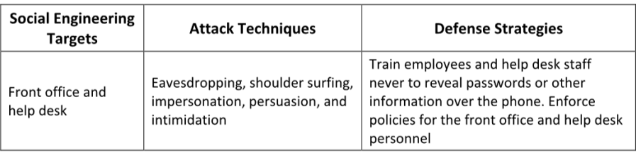
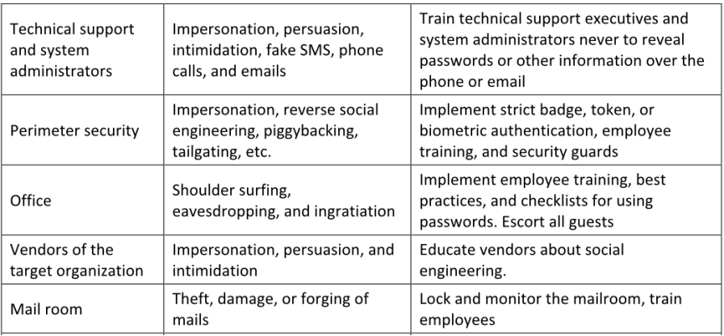

▪ Password Policies: 
Change passwords regularly, 
Set up a password expiration policy
▪ Physical Security Policies
▪ Defense Strategy
▪ Train individuals on security policies
▪ Implement proper access privileges
 Availability of resources only to authorized users

##### Anti-Phishing Toolbar
▪ Netcraft Source: https://www.netcraft.com
▪ PhishTank Source: https://phishtank.com
▪ Scanurl (https://scanurl.net)
▪ Isitphishing (https://isitphishing.org)
▪ Threatcop (https://threatcop.ai)
▪ e.Veritas (https://www.emailveritas.com)
▪ Virustotal (https://www.virustotal.com)

##### **Common Social Engineering Targets and Defense Strategies**

##### **Audit Organization's Security for Phishing Attacks using OhPhish**

▪ OhPhish Source: https://portal.ohphish.com

OhPhish es un portal web diseñado para evaluar la susceptibilidad de los empleados ante ataques de ingeniería social. Es una herramienta de simulación de phishing que proporciona a la organización una plataforma para lanzar campañas simuladas de phishing dirigidas a sus empleados.

La plataforma captura las respuestas de los usuarios y ofrece informes MIS (Sistemas de Información Gerencial) y tendencias en tiempo real, los cuales pueden ser monitoreados por usuario, departamento o puesto.

OhPhish puede utilizarse para auditar la seguridad de una organización frente a ataques de phishing mediante distintos métodos, tales como:
l Entice to Click (Atraer para hacer clic)
l Credential Harvesting (Recolección de credenciales)
l Send Attachment (Enviar archivo adjunto)
l Training (Capacitación)
l Vishing (Phishing por voz)
l Smishing (Phishing por SMS)