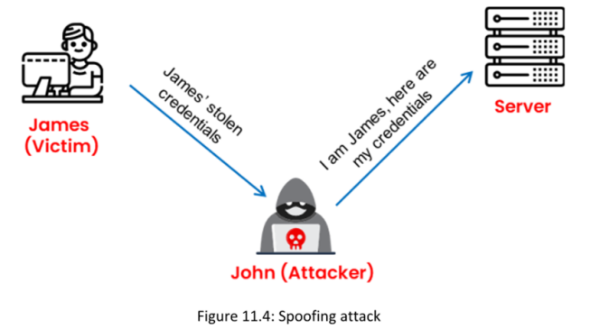
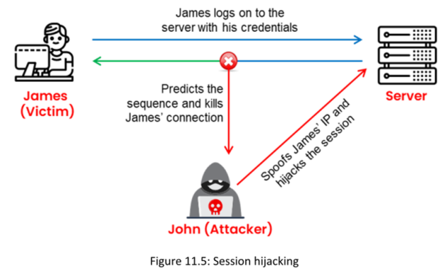

**▪ Passive Session Hijacking :** En un ataque pasivo, después de secuestrar una sesión, un atacante solo observa y graba todo el tráfico durante la sesión. Ejemplo el sniffing de contraseñas

**▪ Active Session Hijacking :** En un ataque activo, un atacante toma el control de una sesión existente, ya sea rompiendo la conexión en un lado de la conversación o participando activamente. Un ejemplo de un ataque activo es un ataque de intermediario (MITM).

**Session Hijacking in OSI Model**

There are two levels of session hijacking in the OSI model: the network-level and application-level

**▪ Network-Level Hijacking** **:** ==El **secuestro de sesión a nivel de red** es la interceptación de paquetes durante la transmisión entre un cliente y un servidor en una sesión **TCP/UDP**==

**▪ Application-Level Hijacking** **:** ==El secuestro de sesión a nivel de aplicación implica tomar el control de la sesión de usuario del Protocolo de Transferencia de Hipertexto (HTTP) mediante la obtención de los IDs de sesión==. A nivel de aplicación, el atacante toma el control de una sesión existente y puede crear nuevas sesiones no autorizadas utilizando datos robados.

|                                                          |                                                                                                    |                                                                                                                    |
| -------------------------------------------------------- | -------------------------------------------------------------------------------------------------- | ------------------------------------------------------------------------------------------------------------------ |
| **Características**                                      | **Secuestro de sesión ciego (Blind Hijacking)**                                                    | **Suplantación (Spoofing)**                                                                                        |
| **Objetivo del ataque**                                  | Tomar control de una sesión activa preexistente.                                                   | Falsificar la identidad de un usuario o máquina para iniciar una nueva sesión.                                     |
| **Tipo de ataque**                                       | Activo, toma control de una sesión ya establecida.                                                 | Activo, inicia una nueva sesión utilizando credenciales robadas.                                                   |
| **Dependencia de la predicción de números de secuencia** | Necesita predecir los números de secuencia de la sesión en curso.                                  | Necesita predecir los números de secuencia para suplantar una sesión.                                              |
| **Intercepción de tráfico**                              | El atacante no puede observar las respuestas directamente (ciego).                                 | El atacante puede observar y registrar el tráfico, pero no tiene control directo sobre la sesión.                  |
| **Dependencia de ruteo de origen**                       | Puede usar el ruteo de origen para interceptar el tráfico.                                         | El ruteo de origen puede ser útil, pero no esencial para la suplantación.                                          |
| **Requiere conocimientos previos del ISN**               | Sí, debe conocer el número de secuencia inicial (ISN) y los paquetes involucrados.                 | Sí, debe conocer los números de secuencia para iniciar la conexión suplantada.                                     |
| **Método de ejecución**                                  | El atacante interrumpe y predice los números de secuencia para tomar control de una sesión activa. | El atacante inicia una sesión desde cero con credenciales robadas, sin necesidad de interrumpir una sesión activa. |
| **Interacción con el host víctima**                      | Se requiere desplazar al usuario legítimo de la sesión (DoS) antes de tomar el control.            | No es necesario desplazar al usuario legítimo; se inicia una nueva sesión.                                         |
| **Requiere control sobre la sesión del usuario**         | Sí, el atacante debe tener control sobre la sesión para "tomarla".                                 | No necesariamente, ya que el atacante puede crear una nueva sesión desde cero.                                     |
| **Resistencia a la autenticación**                       | Más difícil, requiere herramientas especializadas.                                                 | Depende de la capacidad de adivinar o suplantar las credenciales.                                                  |

