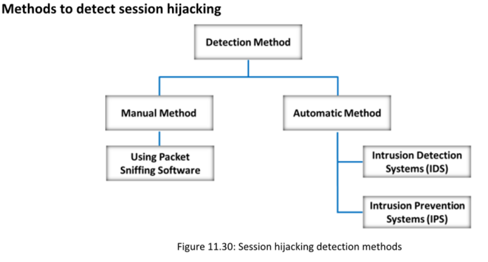

**Protecting against Session Hijacking**

Ø Usar Secure Shell (SSH) para crear un canal de comunicación seguro.
Ø Pasar las cookies de autenticación a través de conexiones HTTPS.
Ø Implementar la funcionalidad de cierre de sesión para que el usuario termine la sesión.
Ø Generar un ID de sesión después de un inicio de sesión exitoso y aceptar solo los IDs de sesión generados por el servidor.
Ø Asegurar que los datos en tránsito estén cifrados e implementar un mecanismo de defensa en profundidad.
Ø Usar cadenas o números aleatorios largos como claves de sesión.
Utilizar diferentes nombres de usuario y contraseñas para diferentes cuentas.

**Session Hijacking Detection Tools**  

▪ USM Anywhere Source: https://cybersecurity.att.com
▪ Wireshark Source: https://www.wireshark.org
▪ Quantum Intrusion Prevention System (IPS) (https://www.checkpoint.com)
▪ SolarWinds Security Event Manager (https://www.solarwinds.com)
▪ IBM Security Network Intrusion Prevention System (https://www.ibm.com)
▪ LogRhythm (https://logrhythm.com)