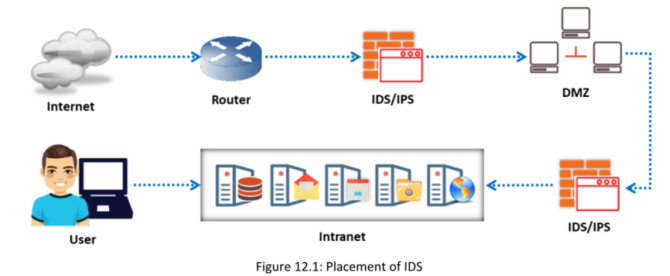

#### **Sistema de Detección de Intrusos (IDS)**

es un software de seguridad o un dispositivo de hardware utilizado para monitorear, detectar y proteger redes o sistemas contra actividades maliciosas; alerta de inmediato al personal de seguridad correspondiente al detectar una intrusión. Son extremadamente útiles, ya que supervisan continuamente el tráfico de entrada y salida de la red en busca de actividades sospechosas para detectar brechas de seguridad en el sistema o la red.Específicamente, analizan el tráfico en busca de firmas que coincidan con patrones de intrusión conocidos y emiten una alerta cuando se detecta una coincidencia. Los IDS pueden clasificarse en IDS activos y pasivos, dependiendo de su funcionalidad. Un IDS pasivo generalmente solo detecta intrusiones, mientras que un IPS activo no solo las detecta, sino que también las previene.

#### **Funciones principales de un IDS:**

▪ Un IDS recopila y analiza información desde el interior de un equipo o una red para identificar posibles violaciones de la política de seguridad, incluyendo accesos no autorizados y usos indebidos.  
▪ Un IDS también se conoce como un “sniffer de paquetes”, ya que intercepta paquetes que circulan a través de diversos medios y protocolos de comunicación, usualmente TCP/IP.  
▪ Los paquetes se analizan después de ser capturados.  
▪ Un IDS evalúa el tráfico en busca de intrusiones sospechosas y emite una alarma al detectar dichas intrusiones.

#### **Ubicación del IDS en la red**

Uno de los lugares más comunes para implementar un IDS es cerca del firewall. Dependiendo del tráfico que se desee monitorear, un IDS se coloca fuera o dentro del firewall para vigilar el tráfico sospechoso que se origina desde el exterior o el interior de la red. Cuando se ubica en el interior, el IDS es ideal si se encuentra cerca de una zona desmilitarizada (DMZ); sin embargo, la mejor práctica es utilizar una defensa en capas, implementando un IDS frente al firewall y otro detrás del firewall dentro de la red.

#### **Cómo funciona un IDS**

▪ Los IDS cuentan con sensores que detectan firmas maliciosas en los paquetes de datos, y algunos IDS avanzados incluyen detección de comportamiento para identificar patrones de tráfico maliciosos. Incluso si las firmas de los paquetes no coinciden exactamente con las firmas en la base de datos del IDS, el sistema de detección de comportamiento puede alertar a los administradores sobre posibles ataques.  
▪ Si hay coincidencia con una firma, el IDS ejecuta acciones predefinidas, como terminar la conexión, bloquear la dirección IP, descartar el paquete y/o generar una alarma para notificar al administrador.  
▪ Cuando se detecta una coincidencia de firma, se omite la detección de anomalías; de lo contrario, el sensor puede analizar los patrones de tráfico en busca de anomalías.  
▪ Cuando el paquete supera todas las pruebas, el IDS lo reenvía a la red.

#### **Sistema de Prevención de Intrusos (IPS)**

Los sistemas de prevención de intrusos (IPS, por sus siglas en inglés) se consideran IDS activos, ya que no solo son capaces de detectar intrusiones, sino también de prevenirlas. Los IPS son sistemas de monitoreo continuo que a menudo se ubican detrás de los firewalls como una capa adicional de protección. A diferencia de los IDS, que son pasivos, los IPS se colocan en línea dentro de la red, entre la fuente y el destino, para analizar activamente el tráfico de red y tomar decisiones automatizadas sobre el tráfico que ingresa a la red.

Algunas de las acciones que realiza un IPS incluyen:

▪ Generar alertas si se detecta tráfico anómalo en la red  
▪ Registrar continuamente registros en tiempo real de las actividades de la red  
▪ Bloquear y filtrar tráfico malicioso  
▪ Detectar y eliminar amenazas rápidamente, ya que está colocado en línea dentro de la red operativa  
▪ Identificar amenazas con precisión sin generar falsos positivos

Clasificación del IPS:

▪ IPS basado en host (Host-based IPS)    ▪ IPS basado en red (Network-based IPS)

**Ventajas del IPS sobre el IDS:**▪ A diferencia del IDS, el IPS puede bloquear y descartar paquetes ilegales en la red  
▪ El IPS puede utilizarse para monitorear actividades que ocurren dentro de una única organización  
▪ El IPS puede prevenir ataques directos en la red mediante el control del volumen de tráfico