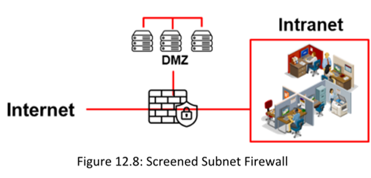
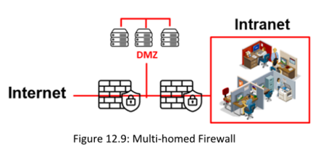
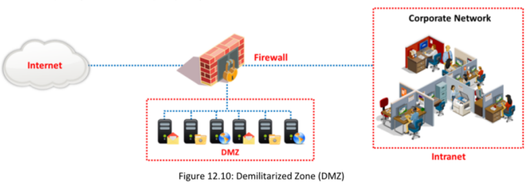

Es un sistema basado en software o hardware ubicado en la puerta de enlace de una red, que protege los recursos de una red privada contra el acceso no autorizado por parte de usuarios de otras redes. Se colocan en la intersección o puerta de enlace entre dos redes, generalmente una red privada y una red pública como Internet.

### **Funciones del Cortafuegos:**

▪ Mecanismo de detección de intrusos diseñado de acuerdo con la política de seguridad de una organización.  
▪ Se puede configurar para restringir el tráfico entrante solo a protocolos como POP y SMTP, habilitando el acceso al correo electrónico. Algunos cortafuegos bloquean ciertos servicios de correo electrónico para evitar el spam.  
▪ Puede configurarse para inspeccionar el tráfico entrante en un "punto de control", donde se realiza una auditoría de seguridad. También puede funcionar como una especie de "intervención telefónica" activa para detectar intentos de acceso a módems dentro de una red segura.  
▪ Los registros del cortafuegos contienen información sobre todos los intentos de acceso a diferentes servicios y notifican al administrador.  
▪ Verifica el tráfico entrante y saliente contra sus reglas y actúa como un router para mover datos entre redes. Permite o deniega solicitudes de acceso realizadas desde un lado hacia servicios en el otro lado.  
▪ Identifica todos los intentos de inicio de sesión en la red con fines de auditoría. Los intentos no autorizados pueden ser identificados mediante una alarma que se activa cuando un usuario no autorizado intenta iniciar sesión.

#### **Firewall Architecture**

Esta compuesta por los siguientes elementos:

##### **▪ Host Bastión (Bastion Host)**

Diseñado para defender la red contra ataques. Actúa como un mediador entre las redes internas y externas. Es un sistema informático diseñado y configurado para proteger los recursos de red frente a ataques. Todo el tráfico que entra o sale de la red pasa por el cortafuegos.

**Este sistema posee dos interfaces:**

Interfaz pública: conectada directamente a Internet.

Interfaz privada: conectada a la intranet.

#### **▪ Screened Subnet (▪ Subred Protegida)**

También conocida como DMZ (zona desmilitarizada), es una red protegida creada utilizando un cortafuegos con dos o tres interfaces (conocido como firewall con tres zonas) ubicado detrás de un cortafuegos de filtrado.

Al usar un cortafuegos con tres interfaces, se realiza la siguiente conexión:
Primera interfaz → Internet
Segunda interfaz → DMZ
Tercera interfaz → Intranet

#### **▪ Multi-homed Firewall**

Un cortafuegos multihomed es un nodo con múltiples interfaces de red (NICs) que se conecta a dos o más redes. Cada interfaz se conecta a diferentes segmentos de red, tanto lógica como físicamente.

Este tipo de cortafuegos:

Mejora la eficiencia y la fiabilidad de una red IP.

Puede tener más de tres interfaces, lo que permite subdividir aún más los sistemas según los objetivos de seguridad específicos de la organización.

#### **Demilitarized Zone (DMZ)**

Es un área que alberga uno o más equipos, o una pequeña subred, colocada como una zona neutral entre la red interna de una empresa y una red externa no confiable, con el fin de prevenir el acceso externo a los datos privados de la empresa.

La DMZ actúa como un búfer de seguridad entre la red interna segura y el Internet inseguro, ya que añade una capa adicional de protección a la red corporativa, impidiendo el acceso directo a otras partes de la red.

Una DMZ se crea utilizando un cortafuegos con tres o más interfaces de red, a las cuales se les asignan roles específicos, tales como:

Red interna confiable
Red DMZ
Red externa no confiable (Internet)

