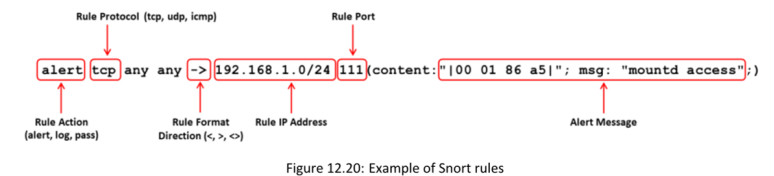

**YARA ▪ yarGen**  
**Fuente:** [https://github.com](https://github.com)

**yarGen** es una herramienta utilizada para generar **reglas YARA**. El principio principal de esta herramienta es crear reglas YARA a partir de cadenas identificadas en **archivos maliciosos (malware)**, eliminando todas las cadenas que también aparecen en archivos **benignos (goodware)**.

Esta herramienta incluye grandes bases de datos de cadenas y códigos de operación (opcodes) de goodware en archivos ZIP, los cuales deben ser extraídos antes de su uso.

Todas las dependencias de esta herramienta pueden instalarse utilizando el siguiente comando:  
`pip install -r requirements.txt`

Además, el usuario puede ejecutar:  
`python yarGen.py --help`  
para obtener información adicional sobre los parámetros de línea de comandos.
**Some additional YARA tools are listed below:**
▪ Vovk (https://github.com) 
▪ Halogen (https://github.com) 
▪ YARA Silly Silly (https://github.com) 
▪ yara-forge (https://github.com) 
▪ YaraRET (https://github.com)

**▪ Snort** **Source: https://www.snort.org**

==Snort es un sistema de detección de intrusiones en la red de código abierto que es capaz de realizar análisis de tráfico en tiempo real y registro de paquetes en redes IP==. Puede realizar análisis de protocolos y búsqueda/coincidencia de contenido, y se utiliza para detectar una variedad de ataques y sondeos, como desbordamientos de búfer, escaneos de puertos sigilosos, ataques CGI, sondeos SMB e intentos de huellas dactilares del sistema operativo (OS fingerprinting). ==Utiliza un lenguaje de reglas flexible para describir el tráfico que debe capturar o permitir, así como un motor de detección que emplea una arquitectura modular de complementos.==

**Usos de Snort:**

Sniffer de paquetes directo, como tcpdump

Registrador de paquetes (útil para la depuración del tráfico de la red, etc.)

Sistema de prevención de intrusiones en la red (NIPS)

Snort Rules

##### **Cada regla debe dividirse en dos secciones lógicas:**
##### ==• The rule header== 
##### ==• The rule options==

==El encabezado de la regla contiene **la acción de la regla, el protocolo, las direcciones IP de origen y destino, la información de puertos de origen y destino, y el bloque CIDR (Classless Inter-Domain Routing).**==

==La sección de opciones de la regla **incluye mensajes de alerta además de información sobre la parte inspeccionada del paquete para determinar si se debe tomar alguna acción según la regla**.==

**Snort Rules: Direction Operator and IP Addresses**

Direction Operator

Example of a Snort rule using the Bidirectional Operator: 
**log tcp !192.168.1.0/24 any <> 192.168.1.0/24 23**

**IP Addresses**

**Example of IP Address Negation Rule:**

**alert tcp !192.168.1.0/24 any -> 192.168.1.0/24 111 (content: "|00 01 86 a5|"; msg: "external mountd access";)**

**Snort Rules: Port Numbers**

**Example of a Port Negation: 
log tcp any -> 192.168.1.0/24 !6000:6010

**▪ Suricata Source: https://suricata.io**

Suricata es un potente motor de detección de amenazas en la red que es capaz de realizar detección de intrusiones en tiempo real (IDS), prevención de intrusiones en línea (IPS), monitoreo de seguridad en la red (NSM) y procesamiento de pcap fuera de línea. Inspecciona el tráfico de la red utilizando reglas extensas y poderosas, además de un lenguaje de firmas.

**Some additional intrusion detection tools :**  

▪ Juniper Network’s IDP system (https://www.solarwinds.com)
▪ Samhain HIDS (https://www.la-samhna.de)
▪ OSSEC (https://www.ossec.net)
▪ Zeek (https://zeek.org)
▪ Cisco Secure IPS (https://www.cisco.com)