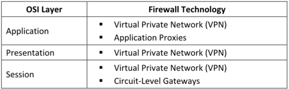
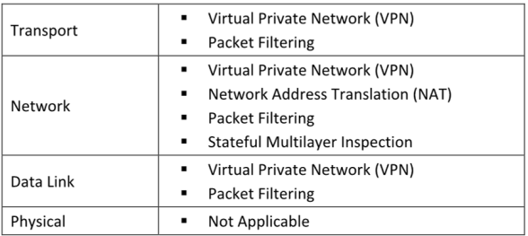

**▪ Network-based Firewalls**

Un **cortafuegos basado en red** es un dispositivo de firewall dedicado que se coloca en el **perímetro de la red**. ==Es una parte integral de la configuración de la red y puede estar incorporado en routers de banda ancha o utilizarse como un producto independiente.Este tipo de firewall emplea la técnica de **filtrado de paquetes**: lee la **cabecera del paquete** para identificar las direcciones de origen y destino, y las compara con un conjunto de reglas predefinidas o creadas por el usuario, que determinan si el paquete debe ser reenviado o descartado== .Ejemplos **Cisco ASA** y **FortiGate**. Estos firewalls están diseñados para proteger la **red de área local privada (LAN)**.
#### **Ventajas:**

**Seguridad:** Un cortafuegos basado en red con su propio sistema operativo (OS) reduce los riesgos de seguridad y proporciona mayores controles de protección.

**Velocidad:** Permite respuestas más rápidas y mayor capacidad de tráfico.

**Interferencia mínima:** Al ser un componente separado de la red, su gestión es más eficiente, y se puede apagar, mover o reconfigurar con poca interferencia en el resto de la red.

 **Desventajas:**

Más costoso que un cortafuegos basado en host.
Difícil de implementar y configurar.
Ocupa más espacio y requiere más cableado.

 
 #### **▪ Cortafuegos Basados en Host**

Un cortafuegos basado en host es similar a un filtro. ==Se sitúa entre una aplicación común y los componentes de red del sistema operativo. Es más útil para usuarios individuales en el hogar y adecuado para usuarios móviles que necesitan seguridad digital cuando trabajan fuera de la red corporativa.==

También proporciona protección contra troyanos y gusanos de correo electrónico comunes.

Intercepta todas las solicitudes de red dirigidas al equipo para determinar si son válidas y lo protege de ataques y accesos no autorizados. También incorpora controles definidos por el usuario, controles de privacidad, filtros web, filtros de contenido, etc., para restringir la ejecución de aplicaciones inseguras en el sistema.
#### **Ventajas:**
 Menor costo que los firewalls basados en red.
 Ideal para uso personal o doméstico.
 Más fácil de configurar y reconfigurar.
#### **Desventajas:**
Consume recursos del sistema.
Difícil de desinstalar completamente.
No apropiado para entornos que requieren tiempos de respuesta rápidos.

#### **Types of Firewalls Based on Working Mechanism**

### **Las principales tecnologías de cortafuegos son:**  

### Filtrado de Paquetes (Packet Filtering)

### Puertas de Nivel de Circuito (Circuit-Level Gateways)

### Cortafuegos a Nivel de Aplicación (Application-Level Firewall)

### Inspección con Estado Multicapa (Stateful Multilayer Inspection)

### Proxies de Aplicación (Application Proxies)

### Traducción de Direcciones de Red (NAT)

### Red Privada Virtual (VPN)

**Technologies operating at each OSI layer**

**Packet Filtering Firewall**

**C****ada paquete se compara con un conjunto de criterios** antes de ser reenviado. Dependiendo del paquete y de esos criterios, el cortafuegos puede:

**Descartar (bloquear)** el paquete,**Transmitirlo (permitirlo)**, **Enviar un mensaje de notificación** al remitente original.

Los criterios de decisión pueden incluir:

Dirección IP de origen y destino

Número de puerto de origen y destino

Protocolo utilizado

Este tipo de cortafuegos **funciona en la capa de Internet del modelo TCP/IP** o en la **capa de red del modelo OSI**.

**Circuit-Level Gateway Firewall**

Un cortafuegos de puerta de enlace de nivel de circuito funciona en la capa de sesión del modelo OSI o en la capa de transporte del modelo TCP/IP. Reenvía datos entre redes sin verificación y bloquea los paquetes entrantes desde el host, pero permite que el tráfico pase a través de sí mismo. La información enviada a computadoras remotas a través de un cortafuegos de puerta de enlace de nivel de circuito parecerá haber originado desde el cortafuegos, ya que el tráfico entrante llevará la dirección IP del proxy (puerta de enlace de nivel de circuito). Estos cortafuegos monitorean las solicitudes para crear sesiones y determinan si esas sesiones serán permitidas.

**Application-Level Firewall**

Los cortafuegos basados en proxy a nivel de aplicación se enfocan en la capa de aplicación en lugar de solo en los paquetes. Las puertas de enlace a nivel de aplicación (proxies) pueden filtrar paquetes en la capa de aplicación del modelo OSI (o la capa de aplicación del TCP/IP). El tráfico entrante y saliente se restringe a los servicios que soporta el proxy; todas las demás solicitudes de servicios son denegadas.

**Stateful Multilayer Inspection Firewall**

Combinan aspectos de los tres tipos de cortafuegos mencionados anteriormente (filtrado de paquetes, puertas de enlace a nivel de circuito y cortafuegos a nivel de aplicación). Filtran los paquetes en la capa de red del modelo OSI (o la capa de internet del modelo TCP/IP) para determinar si los paquetes de la sesión son legítimos, y evalúan el contenido de los paquetes en la capa de aplicación.

**Application Proxy**

Un proxy de nivel de aplicación actúa como un servidor proxy y filtra conexiones para servicios específicos. Filtra las conexiones en función de los servicios y protocolos al actuar como un proxy. Por ejemplo, un proxy FTP solo permitirá que el tráfico FTP pase, mientras que todos los demás servicios y protocolos serán bloqueados. Es un tipo de servidor que actúa como una interfaz entre la estación de trabajo del usuario y la Internet. Se correlaciona con el servidor de puerta de enlace y separa la red empresarial de la Internet.

**Network Address Translation (NAT)**

El NAT ayuda a ocultar el diseño de una red interna y obliga a que las conexiones pasen a través de un punto de congestión. También funciona con un enrutador, y de manera similar al filtrado de paquetes, también modificará los paquetes que el enrutador envía simultáneamente.Cuando la máquina interna reenvía el paquete a la máquina externa, el NAT modifica la dirección de origen del paquete para hacer que parezca que proviene de una dirección válida. Cuando la máquina externa envía el paquete a la máquina interna, el NAT modifica la dirección de destino para convertir la dirección visible en la dirección interna correcta.

**Virtual Private Network (VPN) Firewall**

Es una red que proporciona acceso seguro a la red privada a través de Internet. Las VPN se utilizan para conectar redes de área amplia (WAN). Permiten que las computadoras en una red se conecten a las computadoras de otra red. Se utilizan para la transmisión segura de información sensible a través de una red no confiable mediante encapsulación y cifrado. Emplean cifrado y protección de integridad, lo que permite usar una red pública como si fuera una red privada.

**Next-Generation Firewalls (NGFWs)**

Son soluciones de seguridad de red sofisticadas que realizan funciones de cortafuegos tradicionales. Incorporan características avanzadas como inspección profunda de paquetes, conciencia y control de aplicaciones, sistemas integrados de prevención de intrusiones (IPS) e inteligencia de amenazas basada en la nube. Estas capacidades permiten a los NGFWs abordar de manera eficaz los paisajes de amenazas dinámicas y ofrecer una protección mejorada a las redes contemporáneas.Los NGFWs operan examinando el tráfico de red en varias capas del modelo OSI.

**▪ Firewalls Based on Configuration**

**Network-based Firewalls**

Cisco Secure Firewall ASA (https://www.cisco.com)
PA-7500 (https://www.paloaltonetworks.com)
FortiGate 7121F (https://www.fortinet.com)
Check Point 28000 Quantum Security Gateway (https://www.checkpoint.com)
Juniper SRX (https://www.juniper.net)

**Host-based Firewalls**
Microsoft Defender Firewall (https://www.microsoft.com)
ZoneAlarm Pro Firewall (https://www.zonealarm.com)
Comodo Firewall (https://personalfirewall.comodo.com)
Norton Smart Firewall (https://us.norton.com)
McAfee Firewall (https://www.mcafee.com)

**▪ Firewalls Based on Working Mechanism** 
IPFire (https://www.ipfire.org)
pfSense (https://www.pfsense.org)
SonicWall TZ Series (https://www.sonicwall.com)
BIG-IP Advanced Firewall Manager (https://www.f5.com)
Sophos Firewall (https://www.sophos.com)
WatchGuard Firebox (https://www.watchguard.com)
FortiProxy (https://www.fortinet.com)
SonicWall NSa 6700 (https://www.sonicwall.com)
ZYXEL VPN Firewall (https://www.zyxel.com)
DrayTek Vigor2765 (https://www.draytek.com)

**Firewall Limitations**

Ø Restricción de acceso a servicios valiosos:  pueden restringir a los usuarios el acceso a servicios importantes como FTP, Telnet, NIS, etc., e incluso pueden restringir el acceso a Internet en algunos casos.

Ø No pueden prevenir ataques internos: Los cortafuegos no pueden prevenir los ataques internos (puertas traseras) en una red, como cuando un empleado descontento coopera con un atacante externo.

Ø Punto único de seguridad: El cortafuegos concentra la seguridad en un solo punto, lo que hace que otros sistemas dentro de la red sean vulnerables a ataques de seguridad.

Ø Posibilidad de cuellos de botella: Puede ocurrir un cuello de botella si todas las conexiones pasan a través del cortafuegos, afectando el rendimiento de la red.

Ø Inmunidad limitada ante ingeniería social y ataques basados en datos: El cortafuegos no puede proteger la red contra ataques de ingeniería social o ataques basados en datos, donde el atacante envía enlaces maliciosos o correos electrónicos a los empleados dentro de la red.