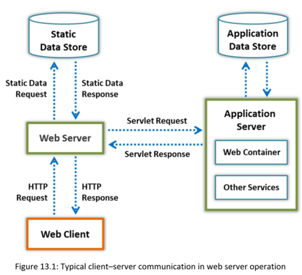
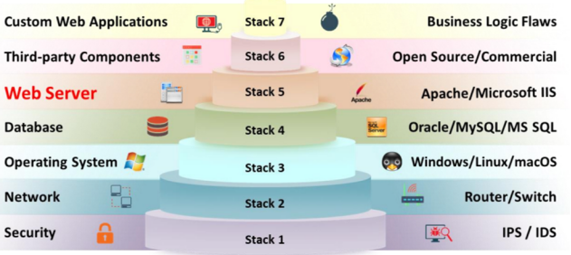

##### **Web Server Operations**

==Un servidor web es un sistema informático que almacena, procesa y entrega páginas web a los clientes globales a través del Protocolo de Transferencia de Hipertexto (HTTP). En general, un cliente inicia un proceso de comunicación mediante solicitudes HTTP. Cuando un cliente desea acceder a algún recurso, como páginas web, fotos o videos, el navegador del cliente genera una solicitud HTTP que se envía al servidor web. **Dependiendo de la solicitud, el servidor web recopila la información o contenido solicitado desde el almacenamiento de datos o servidores de aplicaciones** y responde a la solicitud del cliente con una respuesta HTTP apropiada==. Si un servidor web no puede encontrar la información solicitada, genera un mensaje de error.

**Components of a Web Server**
▪ Document Root
▪ Server Root
▪ Virtual Document Tree
▪ Virtual Hosting
▪ Web Proxy

  

**Web Server Security Issues**

Como se muestra en la figura a continuación, la seguridad organizacional incluye siete niveles, desde el nivel 1 hasta el nivel 7 del stack.

**The** **following are some common oversights that make a web server vulnerable to attacks:**

▪ No actualizar el servidor web con los últimos parches.  
▪ Usar las mismas credenciales de administrador del sistema en todas partes.  
▪ Permitir tráfico interno y saliente sin restricciones.  
▪ Ejecutar aplicaciones y servidores sin endurecer.  
▪ Proporcionar mensajes de error completos con información sobre la versión del servidor.  
▪ Utilizar algoritmos de cifrado SSL/TLS desactualizados.  
▪ Usar complementos de terceros en la aplicación web.

