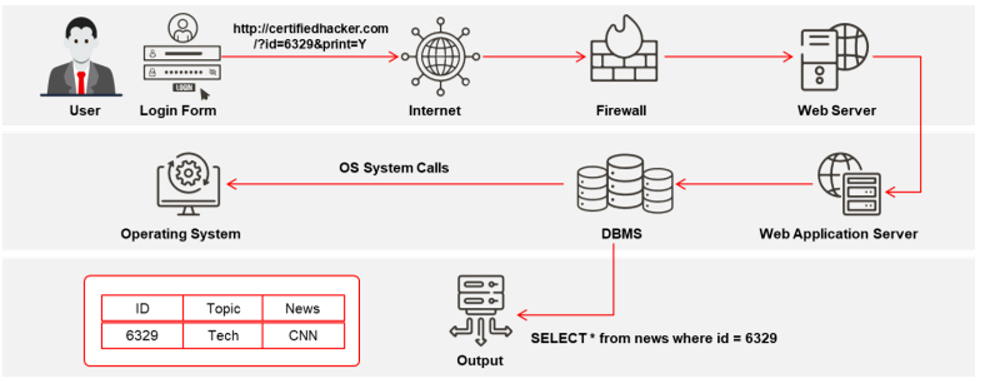

==Las aplicaciones web son programas de software que se ejecutan en navegadores web y actúan como la interfaz entre los usuarios y los servidores web a través de páginas web. Permiten a los usuarios solicitar, enviar y recuperar datos de/desde una base de datos a través de Internet, interactuando mediante una interfaz gráfica de usuario (GUI) amigable. Los usuarios pueden ingresar datos a través de un teclado, un ratón o una interfaz táctil, dependiendo del dispositivo que utilicen para acceder a la aplicación web.==

Basadas en lenguajes de programación compatibles con navegadores como JavaScript, HTML y CSS, las aplicaciones web trabajan en combinación con otros lenguajes de programación, como SQL, para acceder a datos desde las bases de datos. Las aplicaciones web se desarrollan como páginas web dinámicas y permiten a los usuarios comunicarse con los servidores mediante scripts del lado del servidor. Estas aplicaciones permiten a los usuarios realizar tareas específicas como buscar, enviar correos electrónicos, conectarse con amigos, realizar compras en línea, y rastrear y seguir información. Además, existen varias aplicaciones de escritorio que brindan a los usuarios la flexibilidad de trabajar con Internet.

**How Web Applications Work**

**Web Application Architecture**