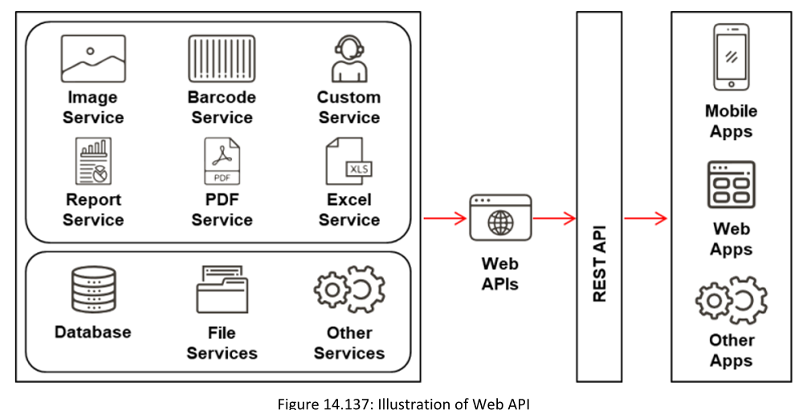
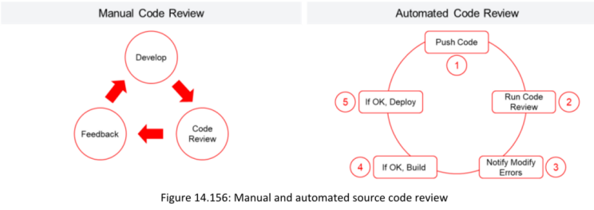

==Una API Web es una interfaz de programación de aplicaciones que proporciona servicios web en línea a aplicaciones del lado del cliente para recuperar y actualizar datos desde múltiples fuentes en línea. Es un tipo especial de interfaz que permite la interacción entre aplicaciones a través de Internet, utilizando algunos protocolos basados en la web.==

##### **Web Service APIs**

**▪ SOAP API:**
Protocolo de comunicación basado en la web que permite la interacción entre aplicaciones que se ejecutan en diferentes plataformas como Windows, macOS, Linux, etc., a través de XML y HTTP.

▪ **REST (Representation State Transfer) API:**
Es un estilo arquitectónico de servicio web que sirve como medio de comunicación entre varios sistemas en la web. permiten que las máquinas solicitantes obtengan acceso rápido y redefinan las representaciones de recursos web, proporcionando un conjunto de protocolos sin estado y operaciones cualitativas.

**▪ RESTful API:** 
Servicio diseñado utilizando los principios REST y los protocolos de comunicación HTTP. RESTful es una colección de recursos que usa métodos HTTP como PUT, POST, GET y DELETE. También está diseñada para que las aplicaciones sean independientes, con el fin de mejorar el rendimiento general, la visibilidad, la escalabilidad, la fiabilidad y la portabilidad de una aplicación .

**▪ XML-RPC:** 
Remote Procedure Call basado en XML (Lenguaje de Marcado Extensible) es un protocolo de comunicación que utiliza un formato XML específico para transferir datos, mientras que SOAP utiliza XML propietario. Es más simple que SOAP y utiliza menos ancho de banda para la transferencia de datos.

**▪ JSON-RPC:** Remote Procedure Call basado en JSON (Notación de Objetos de JavaScript) es un protocolo de comunicación que funciona de la misma manera que XML-RPC, pero utiliza el formato JSON en lugar de XML para transferir los datos.

**Webhooks**

Son callbacks HTTP definidos por el usuario o APIs push que se activan con base en ciertos eventos, como recibir un comentario en una publicación o subir código a un repositorio. Un webhook permite que una aplicación actualice a otras aplicaciones con la información más reciente. Una vez invocado, suministra datos a otras aplicaciones, lo que significa que los usuarios reciben información en tiempo real de manera instantánea.

### **Webhooks vs. APIs**

Los Webhooks son mensajes automáticos enviados desde sitios web hacia un servidor.  
Las APIs se utilizan para la comunicación del servidor hacia el sitio web.

Los Webhooks reciben informes o notificaciones mediante solicitudes HTTP POST únicamente cuando se realiza una nueva actualización.  
Las APIs realizan llamadas sin importar si hay o no actualizaciones de datos.

Los Webhooks actualizan aplicaciones o servicios con información en tiempo real.  
Las APIs requieren implementaciones adicionales para realizar esta actividad.

Los Webhooks tienen menos control sobre el flujo de datos.  
Las APIs permiten un control más fácil sobre el flujo de datos.

#### **API Enumeration** 
**Source:** https://github.com 
##### **==Kiterunner==** 
Is an advanced tool designed for API scanning and contextual content discovery,
specifically tailored for modern web applications that heavily rely on APIs. It outshines conventional tools by not just brute-forcing directories but also by discovering and understanding complex API endpoint structures through context-aware scanning
##### **▪ Analyze Web API Requests and Responses**

**Postman** Source: https://www.postman.com

Launch Attacks

**▪ Fuzzing**
==Los atacantes utilizan la técnica de fuzzing para enviar repetidamente entradas aleatorias al API objetivo con el fin de generar mensajes de error que revelen información crítica. Para realizar fuzzing, los atacantes emplean scripts automatizados que envían numerosas solicitudes con entradas variables.==

▪ Invalid Input Attacks  
▪ Malicious Input Attacks  
▪ Injection Attacks

▪ Exploiting Insecure Configurations 

 Insecure SSL Configuration Insecure, 
 Direct Object References (IDOR),  Insecure Session/Authentication Handling

**REST API Vulnerability Scanning**

▪ Astra Source: https://github.com
Los atacantes utilizan la herramienta **Astra** para detectar y explotar vulnerabilidades subyacentes en una **API REST**. Astra puede descubrir y probar mecanismos de autenticación como **inicio y cierre de sesión**; esta característica facilita que los atacantes la incorporen en el pipeline **CI/CD**. Astra puede invocar una colección de API como valor de entrada; por lo tanto, también puede utilizarse para **escanear APIs REST**.

▪ Fuzzapi (https://github.com)
▪ w3af (https://github.com)
▪ AppSpider (https://www.rapid7.com)
▪ Vooki (https://www.vegabird.com)
▪ OWASP ZAP (https://www.zaproxy.org)

  

**API Security Risks and Solutions Source: https://owasp.org**

**Web Application Fuzz Testing**

Las pruebas de fuzzing en aplicaciones web son un método de prueba blackbox (de caja negra). Es una técnica de control y aseguramiento de calidad utilizada para identificar errores de codificación y vulnerabilidades de seguridad en aplicaciones web. Grandes cantidades de datos aleatorios, conocidos como “fuzz”, son generados por herramientas de pruebas de fuzzing (llamadas fuzzers) y se aplican contra la aplicación web objetivo para descubrir vulnerabilidades que puedan ser explotadas por diversos ataques.

**Fuzz Testing Tools:**

▪ WebScarab (https://owasp.org)
▪ Burp Suite (https://portswigger.net)
▪ AppScan Standard (https://www.hcl-software.com)
▪ Defensics (https://www.synopsys.com)
▪ ffuf (https://github.com)

  

**AI-Powered Fuzz Testing Tool:**
Prompt Fuzzer Source: https://github.com
Prompt Fuzzer is an advanced AI-powered fuzz testing tool designed specifically for GenAI applications.

Las revisiones del código fuente se utilizan para detectar errores y anomalías en las aplicaciones web desarrolladas. Estas revisiones pueden realizarse de forma manual o mediante herramientas automatizadas para identificar áreas específicas en el código,Estas revisiones permiten identificar vulnerabilidades derivadas de datos no validados y malas prácticas de programación por parte de los desarrolladores

