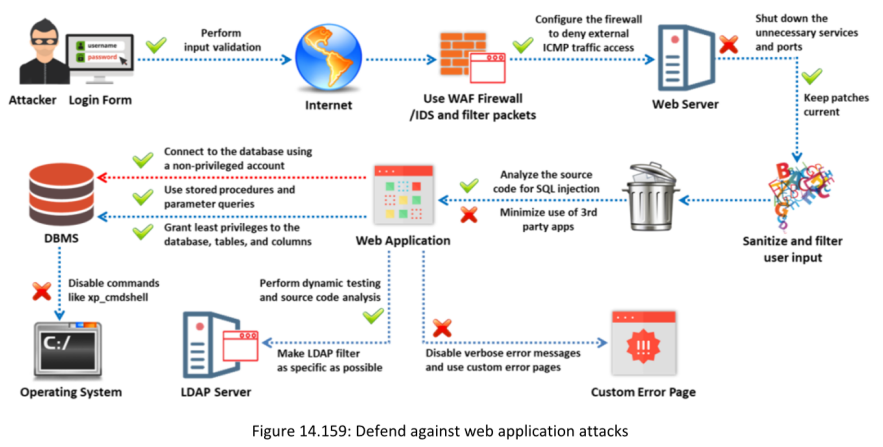

**Web Application Security Testing Tools**

▪ N-Stalker Web App Security Scanner Source: https://www.nstalker.com
▪ Veracode Source: https://www.veracode.com
▪ Invicti Source: https://www.invicti.com
▪ Contrast Security (https://www.contrastsecurity.com)
▪ Snyk (https://snyk.io)
▪ CodeSonar (https://codesecure.com)
▪ HCL AppScan (https://www.hcl-software.com)
 

**Web Application Firewalls**

▪ Cloudflare Web Application Firewall (WAF) Source: https://www.cloudflare.com
▪ Imperva's Web Application Firewall (https://www.imperva.com)
▪ AppWall (https://www.radware.com)
▪ Qualys WAF (https://www.qualys.com)
▪ Barracuda Web Application Firewall (https://www.barracuda.com)
▪ NetScaler WAF (https://www.netscaler.com)