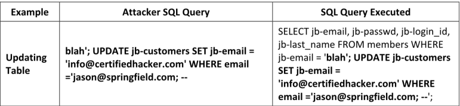
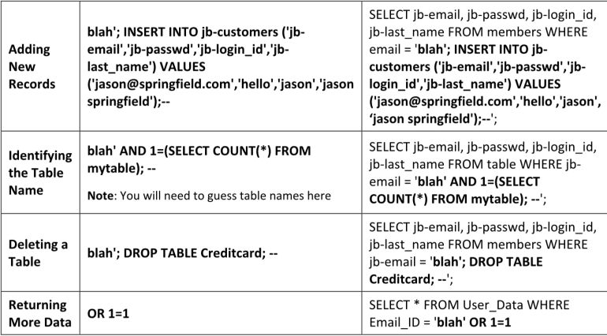

La inyección SQL es una técnica que aprovecha vulnerabilidades causadas por entradas no sanitizadas para introducir comandos SQL a través de una aplicación web y ejecutarlos en una base de datos en el servidor.En esta técnica, el atacante inyecta consultas SQL maliciosas en los formularios de entrada del usuario con el fin de obtener acceso no autorizado a una base de datos o para extraer información directamente de ella.

La inyección SQL puede emplearse para ejecutar los siguientes tipos de ataques:

**▪ Authentication Bypass:** Mediante este ataque, un atacante accede a una aplicación sin proporcionar un nombre de usuario ni una contraseña válidos, y obtiene privilegios administrativos.

**▪ Authorization Bypass:**  En este tipo de ataque, el atacante modifica la información de autorización almacenada en la base de datos aprovechando una vulnerabilidad de inyección SQL.

**▪ Information Disclosure:**  Este ataque permite al atacante obtener información sensible que está almacenada en la base de datos.

**▪ Compromised Data Integrity:**  A través de este ataque, un atacante puede desfigurar páginas web, insertar contenido malicioso o modificar los datos contenidos en la base de datos.

**▪ Compromised Availability of Data:**  Este ataque permite al atacante eliminar información de la base de datos, borrar registros o información de auditoría almacenada.

**▪ Remote Code Execution:**  Mediante este ataque, el atacante puede comprometer el sistema operativo del host.

**SQL Injection and Server-side Technologies**

Entre las diversas tecnologías del lado del servidor se incluyen ASP, ASP.NET, Cold Fusion, JSP, PHP, Python, Ruby on Rails, entre otras. Algunas de estas tecnologías son susceptibles a vulnerabilidades de inyección SQL, lo que hace que las aplicaciones desarrolladas con ellas sean vulnerables a este tipo de ataques.

Algunas bases de datos relacionales comúnmente utilizadas en el desarrollo de aplicaciones web incluyen Microsoft SQL Server, Oracle, IBM DB2 y la base de datos de código abierto MySQL.

**The following table lists some examples of SQL injection attacks**

