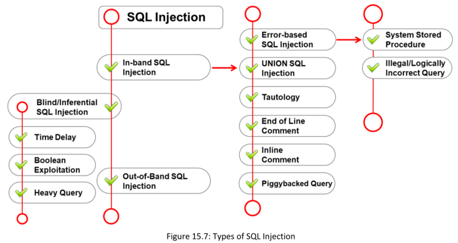

**▪ In-band SQL Injection:**  ==Un atacante utiliza el mismo canal de comunicación tanto para llevar a cabo el ataque como para obtener los resultados. Este tipo de ataque es uno de los más comunes y fáciles de explotar. Las variantes más utilizadas de la inyección SQL in-band son la inyección SQL basada en errores (**error-based SQL injection)** y la **inyección SQL mediante UNION (UNION SQL injection).**==

**▪ Blind/Inferential SQL Injection:** El atacante no recibe mensajes de error del sistema para guiar su ataque. En su lugar, envía consultas SQL maliciosas al servidor de base de datos y observa el comportamiento de la aplicación para inferir información. Este tipo de ataque suele ser más lento, ya que los resultados devueltos generalmente son valores booleanos (verdadero o falso). Los atacantes analizan las respuestas verdaderas o falsas para deducir la estructura de la base de datos y sus datos. En una inyección SQL inferencial, no se transmite información directa a través de la aplicación web, ni es posible obtener el resultado exacto de la consulta, por lo que se le conoce como inyección SQL ciega.

**▪ Out-of-Band SQL Injection:** Los atacantes utilizan canales de comunicación distintos al principal (como funcionalidades de correo electrónico del sistema de bases de datos o funciones de escritura y carga de archivos) para ejecutar el ataque y obtener los resultados. Este método es más complejo de llevar a cabo, ya que requiere que el atacante logre comunicarse con el servidor y determine qué características o funcionalidades específicas ofrece el servidor de bases de datos que utiliza la aplicación web.

#### **In-Band SQL Injection**
##### ==The different types of in-band SQL injection are as follows==
1. **▪ Error-based SQL Injection**

==Un atacante inserta intencionalmente entradas incorrectas en una aplicación, lo que provoca que se devuelvan errores a nivel de base de datos.== El atacante analiza los mensajes de error resultantes para identificar vulnerabilidades de inyección SQL en la aplicación

Consider the following SQL query:

**SELECT * FROM products WHERE id_product=$id_product**

Consider the request to a script that executes the query above:

http://www.example.com/product.php?id=10

The malicious request would be (e.g., Oracle 10g):

http://www.example.com/product.php? id=10||UTL_INADDR.GET_HOST_NAME( (SELECT user FROM DUAL) )—In

2. **▪ System Stored Procedure**

Un atacante puede aprovechar las entradas maliciosas para ejecutar las consultas SQL maliciosas dentro del procedimiento almacenado. Los atacantes explotan los procedimientos almacenados de las bases de datos para llevar a cabo sus ataques.

**anyusername or 1=1'**

3. **▪ Illegal/Logically Incorrect Query** **:**
Un atacante puede obtener información inyectando solicitudes ilegales/lógicamente incorrectas, como parámetros inyectables, tipos de datos, nombres de tablas, etc. En este ataque de inyección SQL, un atacante envía intencionadamente una consulta incorrecta a la base de datos para generar un mensaje de error que puede ser útil para realizar ataques adicionales.

Ejemplo

 **input: Username: 'Bob"**

La consulta resultante será:

**SELECT * FROM Users WHERE UserName = 'Bob"' AND password =**

Mensaje de error:  
**"Incorrect Syntax near 'Bob'. Unclosed quotation mark after the character string '' AND Password='xxx''."**

4. **▪ UNION SQL Injection**

La instrucción **“UNION SELECT”** devuelve la unión del conjunto de datos previsto con el conjunto de datos objetivo. En una inyección SQL mediante UNION, un atacante utiliza una cláusula **UNION** para anexar una consulta maliciosa a la consulta original solicitada, como se muestra en el siguiente ejemplo

**SELECT Name, Phone, Address FROM Users WHERE Id=1 UNION ALL SELECT creditCardNumber,1,1 FROM CreditCardTable**

El atacante comprueba la vulnerabilidad a la inyección SQL mediante UNION añadiendo un carácter de comilla simple (‘) al final de un comando ".php?id=". El tipo de mensaje de error recibido indicará al atacante si la base de datos es vulnerable a una inyección SQL mediante UNION.

5. **▪ Tautology**

Un atacante utiliza una cláusula condicional OR de manera que la condición de la cláusula WHERE siempre sea verdadera. Este tipo de ataque puede usarse para eludir la autenticación de usuarios. Por ejemplo:

**SELECT * FROM users WHERE name = ‘’ OR ‘1’=‘1’;**

Esta consulta siempre será verdadera, ya que la segunda parte de la cláusula OR (‘1’=‘1’) siempre se cumple.

6. **▪ End-of-Line Comment**

Un atacante utiliza comentarios de línea en entradas específicas de inyección SQL. Los comentarios en una línea de código suelen estar representados por (--), y son ignorados por la consulta. Un atacante se aprovecha de esta característica de los comentarios escribiendo una línea de código que termina en un comentario. La base de datos ejecutará el código hasta llegar a la parte comentada,

**SELECT * FROM members WHERE username = 'admin'--' AND password = 'password'**

7. **▪ In-line Comments**

Un ataque de inyección SQL integrando múltiples entradas vulnerables en una sola consulta mediante el uso de comentarios en línea. Este tipo de inyección permite al atacante eludir listas negras, eliminar espacios, ofuscar código y determinar versiones de bases de datos.

Por ejemplo:

**INSERT INTO Users (UserName, isAdmin, Password) VALUES ('".$username."', 0, '".$password."')**

The attacker may provide malicious inputs as follows.

UserName = Attacker', 1, /*

Password = */'mypwd

INSERT INTO Users (UserName, isAdmin, Password) VALUES(‘Attacker', 1, /*’, 0, ‘*/’mypwd’)

8. **▪ Piggybacked Query**

Este tipo de inyección se realiza generalmente en consultas SQL por lotes. La consulta original permanece sin modificar, y la consulta del atacante se acopla a esta. Gracias a este acoplamiento, el sistema de gestión de bases de datos (DBMS) recibe múltiples consultas SQL. Los atacantes utilizan un punto y coma (;) como delimitador de consultas para separar las instrucciones.Este tipo de ataque también se conoce como stacked queries attack. El objetivo del atacante puede ser extraer, agregar, modificar o eliminar datos, ejecutar comandos remotos o realizar un ataque de denegación de servicio (DoS).

Por ejemplo, la consulta SQL original es la siguiente:

**SELECT * FROM EMP WHERE EMP.EID = 1001 AND EMP.ENAME = 'Bob'**

Ahora, el atacante concatena el delimitador (;) y la consulta maliciosa a la consulta original así:

**SELECT * FROM EMP WHERE EMP.EID = 1001 AND EMP.ENAME = 'Bob'; DROP TABLE DEPT;**

##### **Blind/Inferential SQL Injection**

==La inyección SQL a ciegas se utiliza cuando una aplicación web es vulnerable a una inyección SQL, pero los resultados de la inyección no son visibles para el atacante. idéntica a una inyección SQL normal, excepto que cuando un atacante intenta explotar una aplicación, ve una página genérica personalizada en lugar de un mensaje de error útil. El atacante plantea preguntas de tipo verdadero o falso a la base de datos para determinar si la aplicación es vulnerable.== Suele ser posible cuando el desarrollador permite que se muestren mensajes de error genéricos al ocurrir un fallo en la base de datos. Dichos mensajes pueden revelar información sensible o abrir el camino para que un atacante lleve a cabo una inyección SQL.

##### **Blind SQL Injection: Time-based SQL Injection**

La inyección SQL basada en tiempo (a veces llamada inyección SQL de retraso en el tiempo) evalúa el retraso temporal que ocurre en respuesta a consultas de verdadero o falso enviadas a la base de datos. Una declaración WAITFOR detiene el servidor SQL durante un tiempo específico. Según la respuesta, un atacante podrá extraer información como el tiempo de conexión a la base de datos como administrador del sistema o como otro usuario, y lanzar ataques adicionales.

##### **Blind SQL Injection: Boolean Exploitation Boolean**

El atacante utiliza un conjunto de operaciones booleanas para extraer información sobre las tablas de la base de datos. El atacante a menudo emplea esta técnica si parece que la aplicación es vulnerable a un ataque de inyección SQL a ciegas. Si la aplicación no devuelve ningún mensaje de error predeterminado, el atacante intenta usar operaciones booleanas contra la aplicación.

Por ejemplo, la siguiente URL muestra los detalles de un artículo con id = 67:  
http://www.myshop.com/item.aspx?id=67

SELECT Name, Price, Description FROM ITEM_DATA WHERE ITEM_ID = 67

Un atacante puede manipular la solicitud anterior a:  
http://www.myshop.com/item.aspx?id=67 AND 1=2  
Posteriormente, la consulta SQL se modifica a:

SELECT Name, Price, Description FROM ITEM_DATA WHERE ITEM_ID = 67 AND 1 = 2

If the result of the above query is FALSE, no items will be displayed on the web page. Then, the attacker changes the above request to

http://www.myshop.com/item.aspx?id=67 and 1=1 The corresponding SQL query is

SELECT Name, Price, Description FROM ITEM_DATA WHERE ITEM_ID = 67 AND 1 = 1

If the above query returns TRUE, then the details of the item with id = 67 are displayed. Hence, from the above result, the attacker concludes that the page is vulnerable to an SQL injection attack.

##### **Blind SQL Injection: Heavy Query**

Una consulta pesada recupera una gran cantidad de datos y tomará mucho tiempo para ejecutarse en el motor de base de datos. Los atacantes generan consultas pesadas utilizando múltiples uniones en las tablas del sistema, porque las consultas sobre tablas del sistema suelen tardar más tiempo en ejecutarse.

==**SELECT count(*) FROM all_users A, all_users B, all_users C**==

##### **Out-of-Band SQL injection**

Los ataques de inyección SQL fuera de banda son difíciles de realizar porque el atacante necesita comunicarse con el servidor y determinar las características del servidor de base de datos utilizado por la aplicación web.Los atacantes utilizan esta técnica en lugar de la inyección SQL en banda o ciega si no pueden usar el mismo canal a través del cual se están realizando las solicitudes para lanzar el ataque y recopilar los resultados.

Un atacante explota el comando xp_dirtree para enviar solicitudes DNS a un servidor controlado por el atacante. De manera similar, en Oracle Database, un atacante puede usar el paquete UTL_HTTP para enviar solicitudes HTTP desde SQL o PL/SQL a un servidor controlado por el atacante.