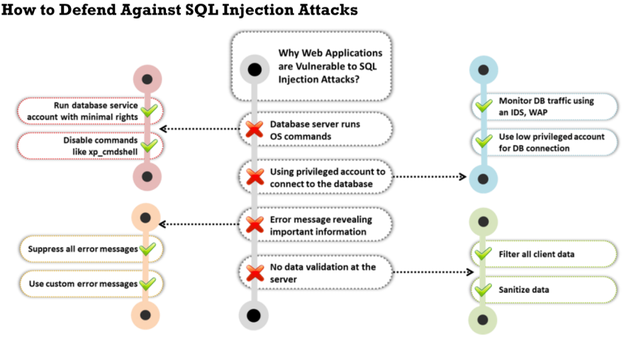

Countermeasures Against SQL Injection

▪ No hagas suposiciones sobre el tamaño, tipo o contenido de los datos que recibe tu aplicación.  
▪ Prueba el tamaño y el tipo de datos de las entradas, y aplica límites apropiados para prevenir desbordamientos de búfer.  
▪ Verifica el contenido de las variables de tipo cadena y acepta solo valores esperados.  
▪ Rechaza las entradas que contengan datos binarios, secuencias de escape y caracteres de comentario.

▪ Evita usar xp_cmdshell para controlar la interacción entre el servidor SQL y los componentes de otros servidores.

