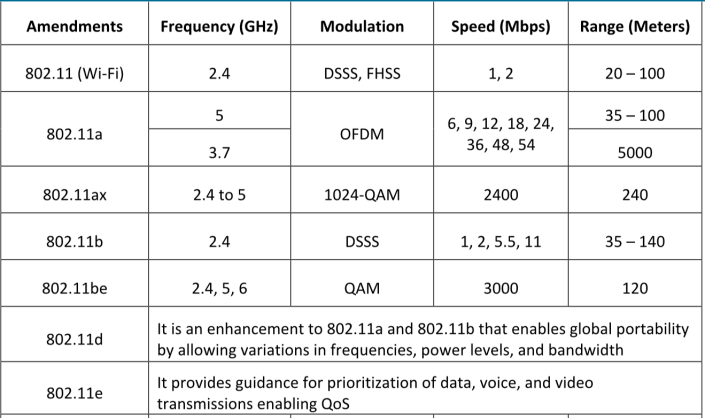
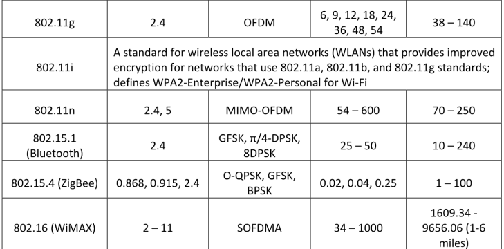

La norma **IEEE 802.11** ha evolucionado de un estándar para una extensión básica inalámbrica a una LAN cableada, a un protocolo maduro que soporta autenticación empresarial, cifrado fuerte y calidad de servicio.

