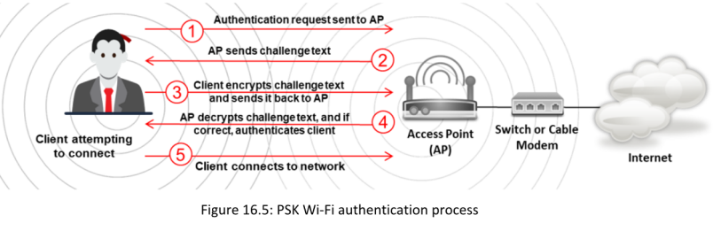
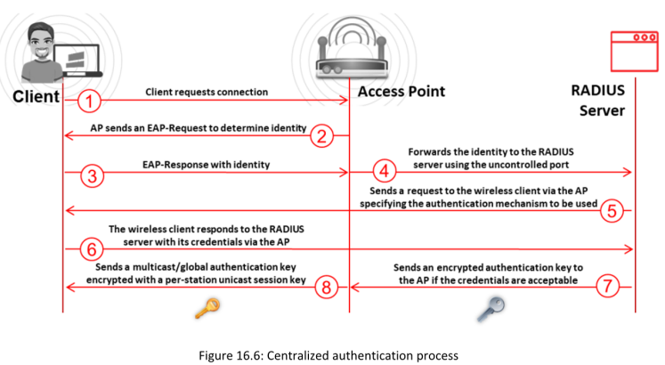

**▪ Pre-Shared Key (PSK) Mode**

También conocido como WPA-PSK o WPA2-PSK, se utiliza para proteger redes inalámbricas mediante una única contraseña compartida. Este modo es especialmente popular en hogares y pequeñas oficinas debido a su simplicidad y facilidad de configuración.

**▪ Centralized Authentication Mode**

Un servidor de autenticación centralizada, conocido como RADIUS (Remote Authentication Dial-In User Service), envía claves de autenticación tanto al punto de acceso (AP) como al cliente, el cual debe autenticarse con el AP.

El modo **WPA/WPA2-Enterprise**, también conocido como modo 802.1X, es un protocolo de seguridad diseñado para entornos empresariales y redes a gran escala. A diferencia de WPA/WPA2-Personal, que utiliza una clave precompartida (PSK-pre-shared key) para la autenticación, WPA/WPA2-Enterprise emplea un servidor de autenticación centralizado, generalmente un servidor RADIUS, para gestionar las credenciales individuales de cada usuario.Cada usuario recibe credenciales únicas, como un nombre de usuario y contraseña o un certificado digital, que se utilizan para autenticar y autorizar el acceso a la red.

