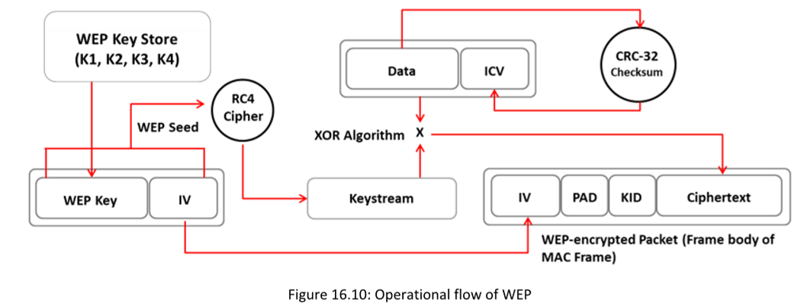
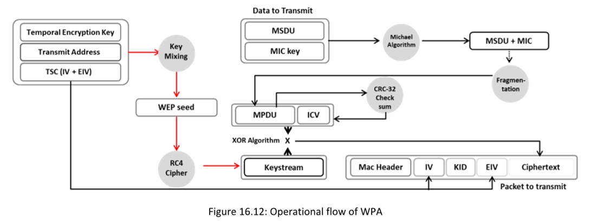
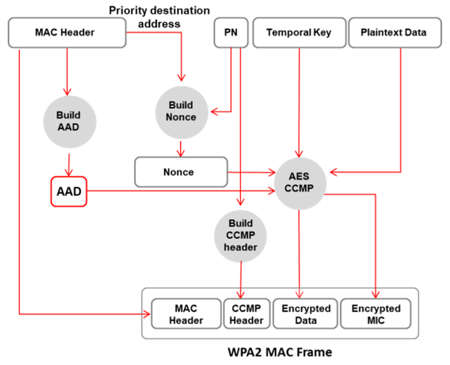
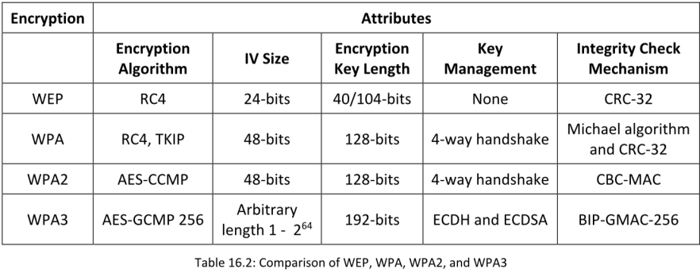

**▪ 802.11i:** Es una enmienda del estándar IEEE que especifica mecanismos de seguridad para redes inalámbricas 802.11.

**▪ WEP:** Wired Equivalent Privacy (Privacidad Equivalente al Cableado) es un algoritmo de cifrado para redes inalámbricas IEEE 802.11. Es un estándar antiguo y se puede vulnerar con facilidad.

**▪ EAP:** El Protocolo de Autenticación Extensible (EAP) admite múltiples métodos de autenticación, como tarjetas de tokens, Kerberos y certificado

**▪ LEAP:** ==Lightweight EAP (LEAP) es una versión propietaria de EAP desarrollada por Cisco.==

**▪ WPA:** Es un protocolo de cifrado inalámbrico avanzado que utiliza **TKIP y Verificación de Integridad de Mensajes (MIC) para proporcionar un cifrado y autenticación sólidos**. **Utiliza un vector de inicialización (IV) de 48 bits, verificación cíclica de redundancia (CRC) de 32 bits y cifrado TKIP para la seguridad inalámbrica**.

**▪ TKIP:** Es un protocolo de seguridad utilizado en WPA como reemplazo de WEP.

**▪ WPA2:** Es una mejora de WPA que utiliza AES y el Protocolo de Autenticación de Código de Bloque de Encadenamiento en Modo Contador (CCMP) para el cifrado de datos inalámbricos.

**▪ AES:** Es un cifrado de clave simétrica utilizado en WPA2 como reemplazo de TKIP.

**▪ CCMP:** Es un protocolo de cifrado utilizado en WPA2 para un cifrado y autenticación sólidos.

**▪ WPA2 Enterprise:** Integra los estándares EAP con el cifrado WPA2.

**▪ RADIUS:** Es un sistema de gestión centralizada de autenticación y autorización.

**▪ PEAP:** Es un protocolo que encapsula EAP dentro de un túnel Transport Layer Security (TLS) cifrado y autenticado.

**▪ WPA3:** Es un protocolo de seguridad Wi-Fi de tercera generación que proporciona nuevas características para uso personal y empresarial. Utiliza Galois/Counter Mode-256 (GCMP-256) para el cifrado y el código de autenticación de mensajes hash de 384 bits con el Algoritmo de Hash Seguro (HMAC-SHA-384) para la autenticación.

**WEP**

Es un cifrador de flujo que utiliza **RC4** para producir un flujo de bytes que se combinan (mediante XOR) con el texto claro. La longitud de la clave WEP y la clave secreta son las siguientes:  
▪ WEP de 64 bits usa una clave de 40 bits  
▪ WEP de 128 bits usa una clave de 104 bits  
▪ WEP de 256 bits usa una clave de 232 bits

- WEP es un protocolo de seguridad definido por el estándar 802.11b; fue diseñado para proporcionar a una red LAN inalámbrica un nivel de **seguridad y privacidad** comparable al de una LAN cableada.
    
- WEP **utiliza un vector de inicialización (IV) de 24 bits** para formar el cifrado de flujo RC4 para la confidencialidad y la suma de verificación CRC-32 para la integridad de las transmisiones inalámbricas.
    
- Tiene vulnerabilidades significativas y fallos de diseño, por lo que **puede ser fácilmente vulnerado**.

**Fallos de WEP**  
▪ No existe un método definido para la distribución de claves de cifrado:  
o Las claves precompartidas (PSK) se establecen una vez en la instalación y rara vez (si es que alguna vez) se cambian.  
o Es fácil recuperar el número de mensajes de texto sin cifrar cifrados con la misma clave.  
▪ RC4 fue diseñado para usarse en un entorno más aleatorio que el utilizado por WEP:  
o Como la PSK rara vez se cambia, la misma clave se usa repetidamente.  
o Un atacante monitorea el tráfico y encuentra diferentes formas de trabajar con el mensaje de texto sin cifrar.  
o Con conocimiento del texto cifrado y el texto sin cifrar, un atacante puede calcular la clave.  
▪ Los atacantes analizan el tráfico a partir de capturas de datos pasivas y crackean las claves WEP con la ayuda de herramientas como Fern Wifi Cracker y WEP-key-break.

**Wireless Encryption: Wi-Fi Protected Access (WPA)**

Es un protocolo de seguridad definido por el estándar 802.11i.WPA proporciona una mejor seguridad de cifrado de datos que WEP porque los mensajes pasan por una Verificación de Integridad de Mensajes (MIC) utilizando el Protocolo de Integridad de Clave Temporal (TKIP), que emplea el cifrado por flujo RC4 con claves de 128 bits y un MIC de 64 bits para ofrecer un cifrado y autenticación sólidos. WPA es un ejemplo de cómo 802.11i proporciona un cifrado más fuerte y permite la autenticación mediante clave precompartida (PSK) o EAP.TKIP utiliza claves de 128 bits para cada paquete. El MIC de WPA evita que el atacante modifique o reenvíe los paquetes.WPA utiliza TKIP para el cifrado de datos, lo cual elimina las debilidades de WEP al incluir per-packet mixing functions, MICs, extended IVs and re-keying mechanisms.

**Wireless Encryption: WPA2**

Es compatible con el estándar 802.11i y admite muchas funciones de seguridad que WPA no ofrece.WPA2 introduce el uso del algoritmo de cifrado AES, conforme a la norma FIPS 140-2 del Instituto Nacional de Estándares y Tecnología (NIST), que es un algoritmo de cifrado inalámbrico robusto, junto con el protocolo CCMP (Counter Mode Cipher Block Chaining Message Authentication Code Protocol).

**Modes of Operation**

**▪ WPA2-Personal:** Utiliza una contraseña establecida previamente, ==llamada clave precompartida (PSK), para proteger el acceso no autorizado a la red. Cada dispositivo inalámbrico utiliza la misma clave de 256 bits generada a partir de una contraseña para autenticarse con el punto de acceso (AP)==. En el modo PSK, cada dispositivo de red inalámbrico cifra el tráfico de red usando una clave de 128 bits derivada de una frase de paso de 8 a 63 caracteres ASCII. El enrutador usa la combinación de una frase de paso, el SSID de la red y TKIP para generar una clave de cifrado única para cada cliente inalámbrico. Estas claves de cifrado cambian continuamente.

**▪ WPA2-Enterprise:** ==WPA2-Enterprise utiliza EAP o RADIUS para la autenticación centralizada del cliente mediante múltiples métodos de autenticación, como tarjetas de token, Kerberos y certificados.== WPA-Enterprise asigna una clave cifrada única a cada sistema y la oculta al usuario para proporcionar mayor seguridad y evitar el uso compartido de claves. A los usuarios se les asignan credenciales de inicio de sesión por medio de un servidor centralizado, que deben presentar al conectarse a la red.

**WPA3**

**WPA3** es una implementación avanzada de WPA2 que proporciona protocolos innovadores y utiliza el algoritmo de cifrado **AES-GCMP 256**

**Modos de operación**
▪ **WPA3-Personal:** Este modo se utiliza principalmente para ofrecer autenticación basada en contraseñas. WPA3 es más resistente a ataques que WPA2 porque utiliza un protocolo moderno de establecimiento de claves llamado **Autenticación Simultánea de Iguales (SAE)**, también conocido como **Intercambio de Claves Dragonfly**, que reemplaza el concepto de PSK usado en WPA2-Personal. 

▪ **WPA3-Enterprise:** Este modo se basa en WPA2. Ofrece mejor seguridad que WPA2 en toda la red y protege los datos sensibles utilizando diversos conceptos y herramientas criptográficas. 
==WPA3 utiliza el **Protocolo de Modo Contador/Galois de 256 bits (GCMP-256)**==
==**modo de autenticación de mensajes con hash de 384 bits (HMAC)**==
==**Algoritmo de Hash Seguro**, denominado **HMAC-SHA-384**.==

**Comparison of WEP, WPA, WPA2, and WPA3**

