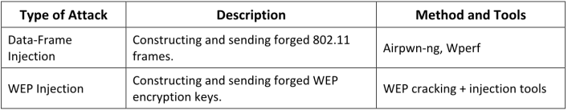
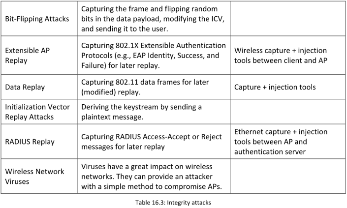
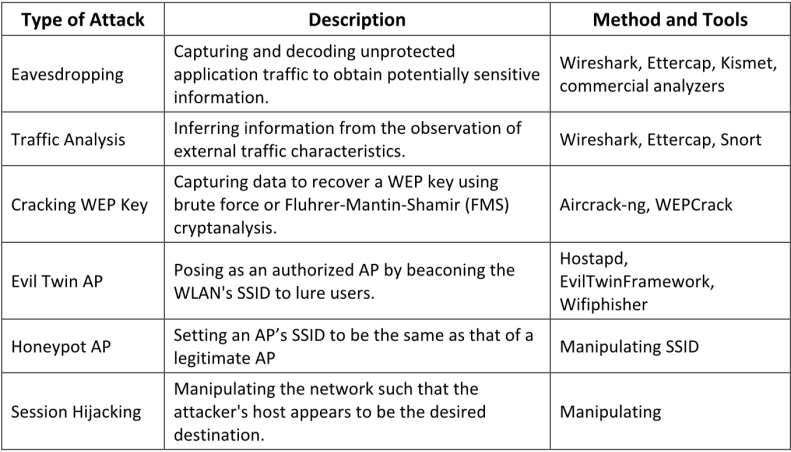
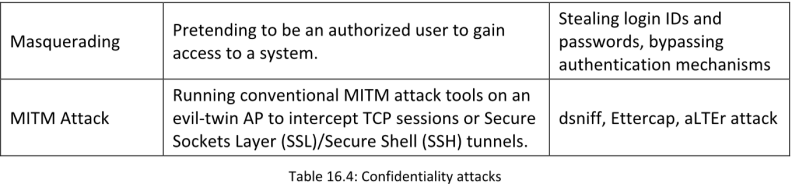
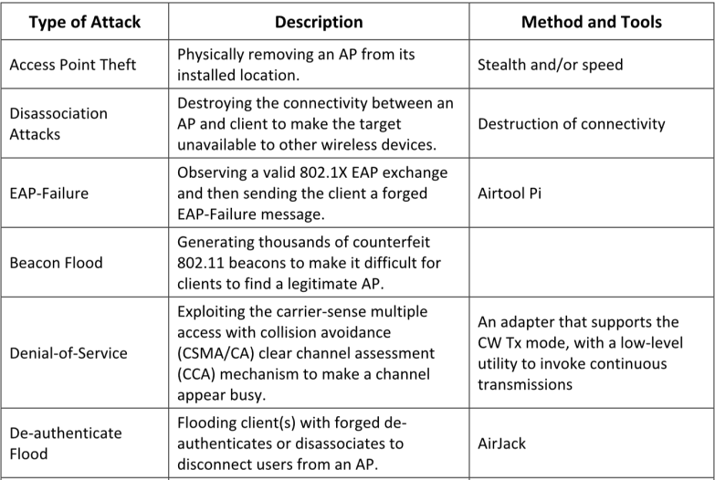
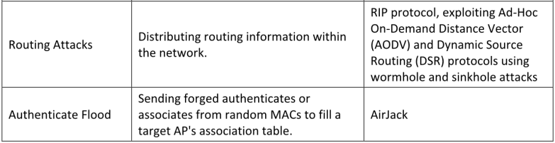
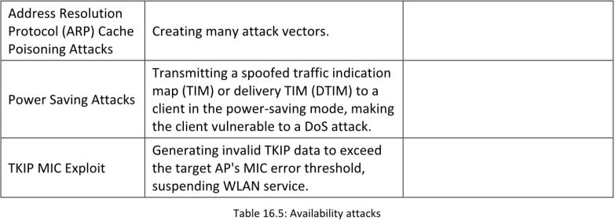
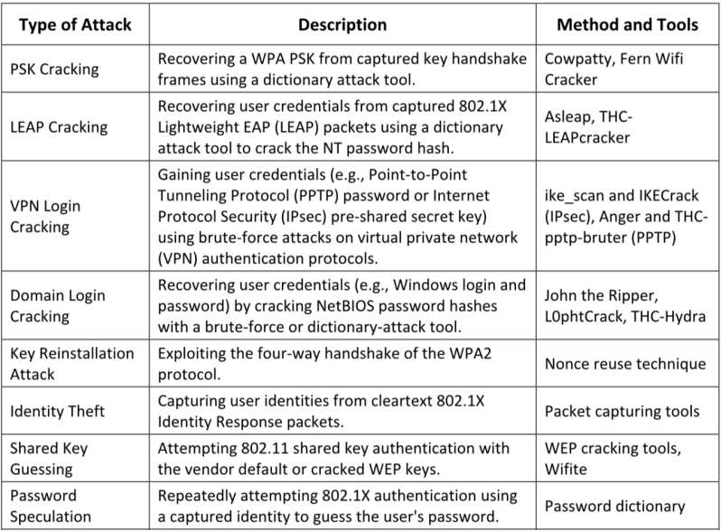

**Access Control Attacks**

Los ataques de control de acceso inalámbrico tienen como objetivo penetrar una red evadiendo las medidas de control de acceso del WLAN, como los filtros de MAC del punto de acceso (AP) y los controles de acceso a puertos Wi-Fi.

**▪ MAC spoofing,**
**▪ AP misconfiguration( SSID broadcast, Weak password,Configuration error)**
**▪ Ad hoc associations**

**Los clientes Wi-Fi pueden comunicarse directamente a través de un modo ad-hoc que no requiere un punto de acceso (AP) para retransmitir paquetes**. Los datos pueden compartirse cómodamente entre los clientes en redes ad-hoc, las cuales son bastante populares entre los usuarios de Wi-Fi. **Surgen amenazas de seguridad cuando un atacante obliga a una red a habilitar el modo ad-hoc.** Algunos recursos de red solo son accesibles en el modo ad-hoc, pero este modo es inherentemente inseguro y no proporciona autenticación ni cifrado fuertes.

**Integrity Attacks**

**Confidentiality Attacks**

**Availability Attacks**

**Authentication Attacks**

**Honeypot AP Attack**

Si múltiples WLAN coexisten en la misma área, un usuario puede conectarse a cualquier red disponible.  Normalmente, cuando un cliente inalámbrico se enciende, este busca una red inalámbrica cercana con un SSID específico. Un atacante se aprovecha de este comportamiento de los clientes inalámbricos configurando una red inalámbrica no autorizada mediante un punto de acceso (AP) malicioso. Este AP tiene antenas de alta potencia (alta ganancia) y utiliza el mismo SSID que la red objetivo. Los usuarios que se conectan regularmente a múltiples WLAN pueden conectarse al AP malicioso. Estos APs montados por atacantes se denominan APs “honeypot” o señuelo. Transmiten una señal de baliza más fuerte que los APs legítimos, por lo que las tarjetas de red (NIC) que buscan la señal más fuerte disponible pueden conectarse al AP falso. Si un usuario autorizado se conecta a un AP honeypot, se crea una vulnerabilidad de seguridad y el atacante podría obtener información sensible del usuario, como identidad, nombre de usuario y contraseña.

**Wormhole Attack**

Un ataque de túnel explota protocolos de enrutamiento dinámico como el **Dynamic Source Routing (DSR)** y el **Ad-Hoc On-Demand Distance Vector (AODV)**. En este tipo de ataque, el atacante se ubica estratégicamente dentro de la red objetivo para espiar y registrar transmisiones inalámbricas en curso. Desde esta posición, el atacante anuncia que el nodo malicioso posee la ruta más corta para transmitir datos hacia otros nodos en la red.