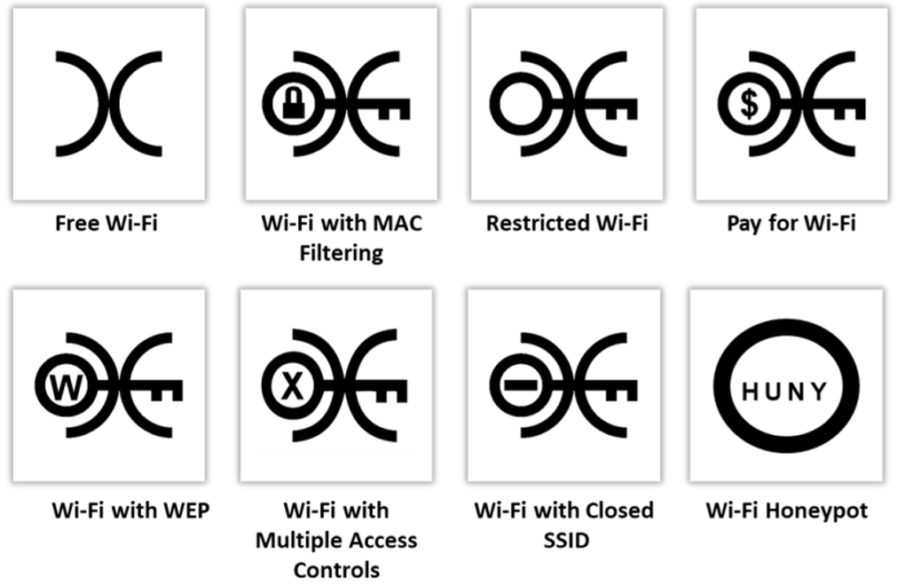

▪ Wi-Fi Chalking Techniques 
- **WarWalking:** Los atacantes caminan con computadoras portátiles habilitadas para Wi-Fi, equipadas con una herramienta de detección inalámbrica, para mapear redes inalámbricas abiertas.
    
- **WarChalking:** Se dibujan símbolos en lugares públicos para anunciar redes Wi-Fi abiertas.
    
- **WarFlying:** Los atacantes utilizan drones para detectar redes inalámbricas abiertas.
    
- **WarDriving:** Los atacantes conducen vehículos con computadoras portátiles habilitadas para Wi-Fi, equipadas con una herramienta de detección inalámbrica, para mapear redes inalámbricas abiertas.

#### **Wi-Fi Discovery Tools** 
**▪ inSSIDer Source:** 
herramienta de optimización y solución de problemas de Wi-Fi que escanea redes inalámbricas usando el adaptador Wi-Fi del usuario, permitiendo visualizar la intensidad de las señales y los canales que están utilizando.

▪ Sparrow-wifi Source: https://github.com
▪ Wi-Fi Scanner (https://lizardsystems.com) 
▪ Acrylic WiFi Heatmaps (https://www.acrylicwifi.com) 
▪ WirelessMon (https://www.passmark.com) 
▪ Ekahau Wi-Fi Heatmaps (https://www.ekahau.com) 
▪ NetSpot (https://www.netspotapp.com) 
▪ AirMagnet® Survey PRO (https://www.netally.com)


#### **Mobile-based Wi-Fi Discovery Tools** 
▪ WiFi Analyzer Source: https://play.google.com 
▪ Opensignal (https://opensignal.com) 
▪ Network Signal Info Pro (https://www.kaibits-software.com)
▪ Net Signal Pro:WiFi & 5G Meter (https://play.google.com) 
▪ NetSpot WiFi Analyzer (https://apps.apple.com) 
▪ WiFiman (https://play.google.com) 

**Detección de Puntos de Acceso con WPS Habilitado**  
Los atacantes utilizan la utilidad de línea de comandos **Wash** para identificar puntos de acceso (AP) con **WPS habilitado** en la red inalámbrica objetivo.

```
sudo wash -i wlan0

```

##### **Wireless Traffic Analysis**
**▪ Wireshark** 
**▪ CommView for Wi-Fi** 
**▪ Omnipeek® Network Protocol Analyzer (https://www.liveaction.com)** 
**▪ Kismet (https://www.kismetwireless.net)** 
**▪ SolarWinds Network Performance Monitor (https://www.solarwinds.com)** 
**▪ Acrylic Wi-Fi Analyzer (https://www.acrylicwifi.com)** 
**▪ airgeddon (https://github.com)**
