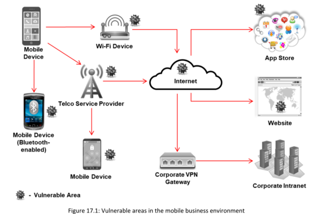
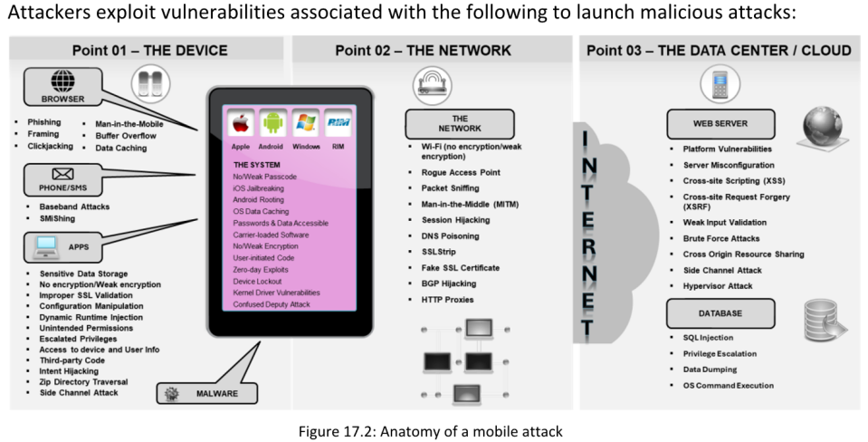
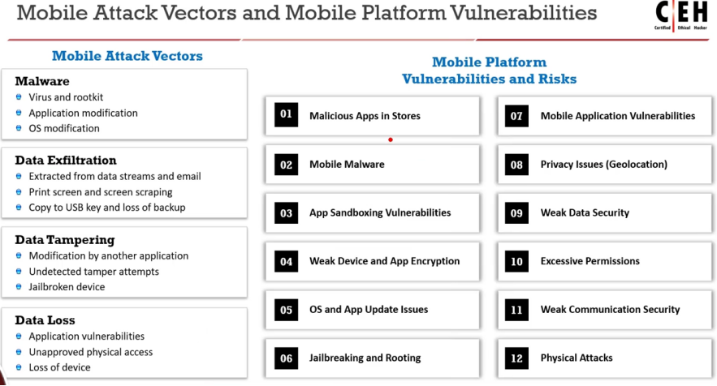
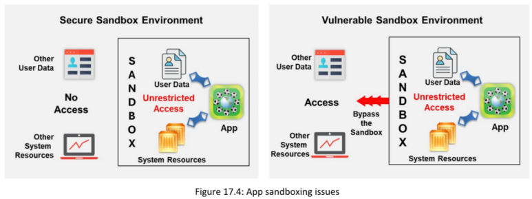

**OWASP Top 10 Mobile Risks - 2024**

**▪ M1 - Improper Credential Usage**

**▪ M2 - Inadequate Supply Chain Security (Seguridad Inadecuada de la Cadena de Suministro)** riesgos asociados con el uso de componentes y bibliotecas de terceros obsoletos o defectuosos en aplicaciones móviles.

**▪ M3 - Insecure Authentication/Authorization**

Uso de los mecanismos de autenticación y autorización dentro de las aplicaciones móviles, a menudo como resultado de políticas de contraseñas débiles, manejo inseguro de tokens o verificaciones de autorización inapropiadas.

**▪ M4 - Insufficient Input/Output Validation**

Implica la validación o depuración inadecuada de las entradas de usuarios o fuentes externas dentro de una aplicación móvil, lo que puede llevar a ataques como inyección SQL, inyección de comandos y Cross-Site Scripting (XSS).

**▪ M5 - Insecure Communication** Ocurre cuando las aplicaciones móviles utilizan protocolos de comunicación inseguros o obsoletos, configuraciones incorrectas o certificados SSL inválidos, lo que permite a los atacantes interceptar o alterar los datos transmitidos.

**▪ M6 - Inadequate Privacy Controls** se refiere a la protección insuficiente de la información personal identificable (PII), como nombres, direcciones y datos financieros, por parte de los desarrolladores de aplicaciones. Esto puede ocurrir debido a control de acceso a datos deficiente y incumplimiento de leyes de privacidad. Los atacantes explotan esta vulnerabilidad para cometer robo de identidad, fraude, suplantación, uso indebido de datos

**▪ M7 - Insufficient Binary Protections**

abarca amenazas de modificación de código e ingeniería inversa, que ocurren cuando las aplicaciones móviles carecen de protección contra estas actividades, lo que lleva a ataques binarios.

**▪ M8 - Security Misconfiguration**

aborda las amenazas derivadas de **configuraciones de seguridad incorrectas o incompletas** en las aplicaciones móviles, incluidas **cifrado/hash débil**, **almacenamiento no protegido y permisos de archivos**, **controles de acceso mal configurados** y **gestión de sesiones incorrecta**. Las malas configuraciones, como características de depuración habilitadas, permisos innecesarios, credenciales predeterminadas no modificadas o **protocolos de comunicación inseguros**▪

**▪ M9 - Insecure Data Storage** Involucra el riesgo de almacenar datos sensibles de manera insegura en aplicaciones móviles, lo que incluye almacenamiento en texto claro, bases de datos/ubicaciones no aseguradas, protección de datos insuficiente, gestión inapropiada de credenciales de usuario y métodos de cifrado débiles.

**▪ M10 - Insufficient Cryptography** se enfoca en los riesgos derivados del uso de métodos de cifrado débiles o desactualizados, mala gestión de claves o fallos en la implementación que permiten a los atacantes desencriptar datos cifrados, manipular procesos criptográficos o acceder a información sensible.

### **Anatomy of a Mobile Attack**

**Security Issues Arising from App Stores**

Las tiendas de aplicaciones son objetivos comunes para los atacantes que buscan distribuir malware y aplicaciones maliciosas.

Los atacantes pueden descargar una aplicación legítima, reempaquetarla con malware y cargarla en una tienda de aplicaciones de terceros, desde donde los usuarios la descargan, considerándola genuina

Los atacantes también pueden realizar ingeniería social, lo que obliga a los usuarios a descargar y ejecutar aplicaciones fuera de las tiendas oficiales de aplicaciones. La falta de revisión adecuada de las aplicaciones o la ausencia total de esta revisión generalmente conduce a la entrada de aplicaciones maliciosas y falsas en el mercado. Las aplicaciones maliciosas pueden dañar otras aplicaciones y datos, y enviar la información sensible de los usuarios a los atacantes.

**App Sandboxing Issues**

El sandboxing de aplicaciones es un mecanismo de seguridad fundamental que protege tanto a los sistemas como a los usuarios al restringir el acceso de una aplicación únicamente a los recursos necesarios para cumplir su función dentro de la plataforma móvil. Este enfoque resulta especialmente útil al ejecutar código no probado o software procedente de fuentes no confiables o no verificadas, como terceros, proveedores, usuarios o sitios web externos.el sandboxing mejora considerablemente la seguridad, impidiendo accesos no autorizados, protegiendo los recursos del sistema y limitando la propagación de malware como troyanos o virus. Además, evita que las aplicaciones interactúen entre sí o se comprometan mutuamente. Sin embargo, es importante tener en cuenta que las aplicaciones maliciosas aún pueden explotar vulnerabilidades del sistema para evadir el sandbox y causar daños.

