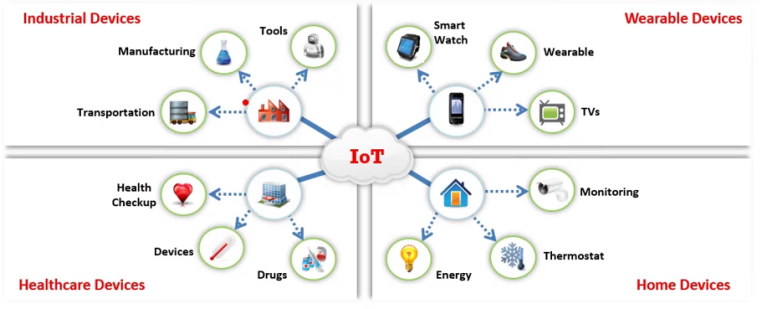

El Internet de las Cosas (IoT), también conocido como Internet de Todo (IoE), hace referencia a dispositivos informáticos conectados a la web que pueden detectar, recolectar y enviar datos mediante sensores, procesadores y hardware de comunicación integrados. Un “objeto” en el IoT puede ser algo natural, hecho por humanos o máquinas, siempre que tenga capacidad de comunicación en red.

El IoT aprovecha tecnologías ya existentes o emergentes (sensores, redes, robótica) para lograr una mayor automatización, integración y análisis en sistemas diversos.

Características clave del IoT

Conectividad, Sensores, Inteligencia artificial (AI), Dispositivos pequeños, Interacción activa y continua

##### ¿Cómo funciona el IoT?

##### La tecnología IoT incluye cuatro componentes principales:

##### Sensing Technology: Equipados con sensores, recopilan información del entorno (temperatura, gases, ubicación, maquinaria, datos de salud, etc.).

##### IoT Gateways: Actúan como puente entre la red interna del dispositivo y la red externa del usuario o la nube.

##### Cloud Server/Data Storage: Donde se almacenan y analizan los datos recibidos a través del gateway.

##### Remote Control using Mobile App: Permiten al usuario controlar y monitorear el dispositivo desde cualquier lugar mediante apps en móviles, tablets o laptops.

### **IoT Application Protocols**

**▪ CoAP:** Constrained Application Protocol (CoAP) is a web transfer protocol used to transfer messages between constrained nodes and IoT networks

**▪ Edge:** Edge computing helps the IoT environment to move computational processing to the edge of the network, allowing smart devices and gateways to perform tasks and services from the cloud end.

**▪ LWM2M:** Lightweight Machine-to-Machine (LWM2M) is an application-layer communication protocol used for application-level communication between IoT devices

**▪ Physical Web:** Physical Web is a technology used to enable faster and seamless interaction with nearby IoT devices.

**▪ XMPP:** eXtensible Messaging and Presence Protocol (XMPP) is an open technology for real-time communication used for IoT devices

**▪ Mihini/M3DA:** Mihini/M3DA is a software used for communication between an M2M server and applications running on an embedded gateway

**IoT Communication Models**

 **▪ Device-to-Device Communication Model**

inter-connected devices interact with each other through the Internet, but they predominantly use protocols such as ZigBee, Z-Wave or Bluetooth.

**▪ Device-to-Cloud Communication Model**

In this type of communication, devices communicate with the cloud directly, rather than directly communicating with the client to send or receive data or commands. It uses communication protocols such as Wi-Fi or Ethernet, and sometimes uses Cellular as well.

 **▪ Device-to-Gateway Communication Model**

In the device-to-gateway communication model, the IoT device communicates with an intermediate device called a gateway, which in turn communicates with the cloud service.

**▪ Back-End Data-Sharing Communication Model**

This type of communication model extends the device-to-cloud communication type such that the data from the IoT devices can be accessed by authorized third parties. Here, devices upload their data onto the cloud, which is later accessed or analyzed by third parties.