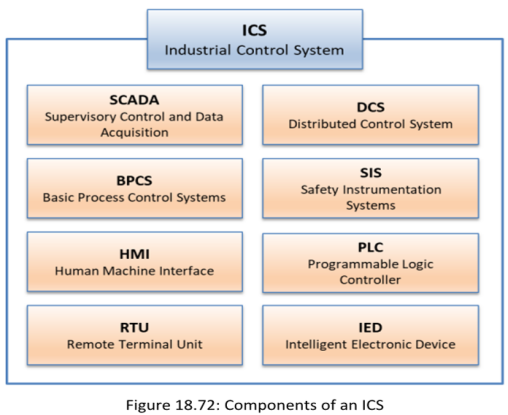
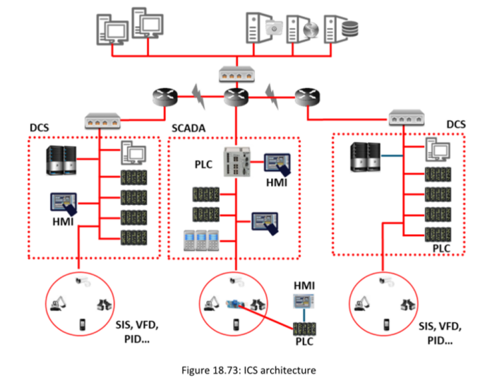
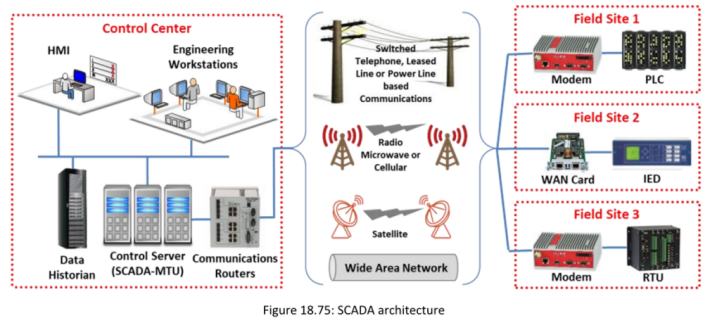
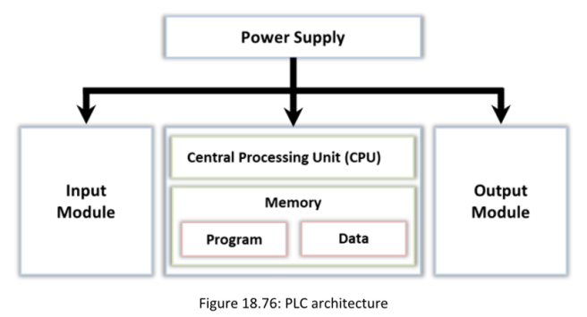
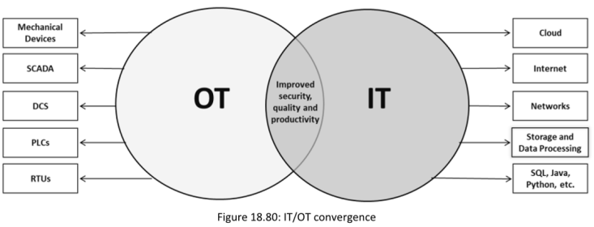

OT (Tecnología Operativa) es una combinación de software y hardware diseñado para detectar o provocar cambios en operaciones industriales mediante la supervisión directa y/o el control de dispositivos físicos industriales. Estos dispositivos incluyen interruptores, bombas, luces, sensores, cámaras de vigilancia, ascensores, robots, válvulas y sistemas de calefacción y refrigeración.Esta tecnología incluye Sistemas de Control Industrial (ICS), que abarcan Sistemas de Control y Adquisición de Datos (SCADA), Unidades Terminales Remotas (RTU), Controladores Lógicos Programables (PLC), Sistemas de Control Distribuido (DCS) y muchos otros sistemas de red dedicados que ayudan a supervisar y controlar operaciones industriales.

![[image20250606090724.png]]

**Introduction to ICS**

#### **Industrial Control System (ICS)**

El Sistema de Control Industrial (ICS) es una parte esencial de todo proceso industrial e infraestructura crítica en la industria.Un ICS suele hacer referencia a un conjunto de distintos tipos de sistemas de control y sus equipos asociados, como sistemas, dispositivos, redes y controles utilizados para operar y automatizar varios procesos industriales.

La operación de los sistemas ICS puede configurarse en tres modos, a saber: modo de bucle abierto, modo de bucle cerrado y modo de bucle manual.(**namely open loop, closed loop, manual loop mode**. )

**▪ Bucle Abierto:** La salida del sistema depende de los ajustes preconfigurados.  
**▪ Bucle Cerrado:** La salida siempre tiene un efecto sobre la entrada para alcanzar el objetivo deseado.  
**▪ Bucle Manual:** El sistema está completamente bajo el control de los humanos.

#### **DCS**:

Un DCS se utiliza para controlar sistemas de producción distribuidos dentro de una misma ubicación geográfica.Se emplea principalmente en procesos grandes, complejos y distribuidos que se llevan a cabo en industrias como la fabricación de productos químicos y plantas nucleares, refinerías de petróleo.Contiene una unidad centralizada de control supervisado que se encarga de controlar múltiples controladores locales, miles de puntos de entrada/salida (E/S) y varios otros dispositivos de campo que forman parte del proceso de producción general.Opera mediante un lazo de control supervisado centralizado, como SCADA y MTU, que conecta un grupo de controladores localizados como RTU/PLC para ejecutar todas las tareas necesarias para el funcionamiento del proceso de producción completo.

#### **▪ Supervisory Control and Data Acquisition (SCADA)**

SCADA es un sistema centralizado de control supervisado que se utiliza para controlar y monitorear instalaciones e infraestructuras industriales.Los sistemas SCADA proporcionan control y monitoreo centralizados de múltiples entradas y salidas de procesos al integrar el sistema de adquisición de datos con la transmisión de datos.

**▪ Programmable Logic Controller (PLC)**

El PLC es una **pequeña computadora de control de estado sólido** cuyas instrucciones pueden personalizarse para realizar una tarea específica. Las instrucciones almacenadas en los PLCs se utilizan para ejecutar funciones específicas como: **lógica, temporización, conteo, control de entradas/salidas (I/O), comunicación, operaciones aritméticas y procesamiento de archivos y datos**.Realizan una **monitorización continua de los valores de entrada** generados por sensores, y generan las salidas necesarias para el funcionamiento de los actuadores.Un sistema PLC consta de tres módulos: **CPU Module****,Power Supply Module,I/O Modules(Digital I/O**

**Module,Analog I/O Module,Communication I/O Module)**

**▪ Basic Process Control System (BPCS)**

Un BPCS es responsable de realizar el control de procesos y la supervisión para la infraestructura industrial. son dinámicos por naturaleza y son altamente adaptables a las condiciones cambiantes del proceso. Son aplicables a todo tipo de lazos de control, incluyendo control de temperatura, lotes, presión, flujo, retroalimentación y alimentación anticipada utilizados en industrias como la química, petróleo y gas, y alimentos y bebidas.

**▪ Safety Instrumented Systems (SIS)**

Un SIS (Sistema Instrumentado de Seguridad) es un sistema de control automatizado diseñado para salvaguardar el entorno de fabricación en caso de un incidente peligroso en la industria. Monitorean y realizan "funciones de control específicas" para apagar el sistema monitoreado o llevarlo a un estado seguro predefinido, con el fin de reducir los impactos adversos de un incidente.

**▪ Industrial Demilitarized Zone (IDMZ)**

La zona desmilitarizada es una barrera entre la zona de fabricación (sistemas OT) y la zona empresarial (sistemas IT) que permite una conexión de red segura entre ambos sistemas. Esta zona se crea para inspeccionar la arquitectura general. Si algún error o intrusión compromete los sistemas operativos, la IDMZ retiene el error y permite que la producción continúe sin interrupciones.

#### **OT Technologies and Protocols**
![[Pasted image 20250606091404.png]]

#### **MITRE ATT&CK for ICS**

Se refiere a los métodos o técnicas que un atacante puede emplear para establecer acceso inicial dentro del entorno ICS (sistema de control industrial) objetivo.

**Técnicas utilizadas por un atacante para obtener acceso inicial:**

**Compromiso por navegación (Drive-by compromise):** Un atacante puede obtener acceso al sistema OT explotando el navegador web del usuario objetivo, engañándolo para que visite un sitio web comprometido durante una sesión de navegación normal.

**Exploiting a public-facing software application:**Un atacante explota las vulnerabilidades conocidas de una aplicación accesible desde Internet para obtener acceso a una red OT. Dichas aplicaciones pueden ser utilizadas para la supervisión y gestión remota.

**Exploiting remote services:** Un atacante puede manipular las vulnerabilidades conocidas de una aplicación aprovechando los mensajes de error generados por el sistema operativo, el programa o el núcleo (kernel) para realizar más ataques a los servicios remotos.

**▪ Execution**

Se refiere al intento de un atacante de ejecutar código malicioso, manipular datos o realizar otras funciones del sistema mediante enfoques ilegítimos.Algunas de las técnicas asociadas con esta etapa son las siguientes:

**Changing the operating mode:** Un atacante obtiene acceso adicional a varias funcionalidades OT manipulando los modos de operación de un controlador dentro de la infraestructura, por ejemplo, mediante la descarga de programas.

**Command-line interface (CLI):** utiliza la CLI para ejecutar diversos comandos maliciosos y comunicarse con un sistema OT. Esto les permite instalar y ejecutar diferentes programas maliciosos y realizar operaciones maliciosas sin ser detectados.

**Execution through APIs:** Los atacantes inyectan código en las APIs para realizar funciones específicas en un sistema después de que son llamadas por el software asociado.

**▪ Persistence**

Los atacantes emplean procedimientos de persistencia para mantener el acceso dentro del entorno ICS, incluso si el dispositivo comprometido se reinicia o la comunicación se interrumpe.

**Modifying a program:** Un atacante abusa de un controlador en un sistema OT cambiando o adjuntando un programa a él. Esto permite modificar el comportamiento de cómo el controlador se comunica con otros dispositivos o procesos dentro de ese entorno.

**Module firmware:** Un atacante puede insertar un firmware malicioso en los dispositivos de hardware para mantener el acceso a otros dispositivos o sistemas y dejar huellas para ataques a largo plazo

**Project file infection:** Los atacantes usan código malicioso para infectar dependencias de archivos como objetos o variables necesarias para el funcionamiento de los controladores lógicos programables (PLCs).

**▪ Evasion** Attackers utilizan esta táctica para evadir los mecanismos de defensa convencionales durante el transcurso de sus operaciones. 

**Removing the indicators:** Se eliminan posibles indicadores de ataque de un host para evitar la detección y cubrir los rastros del ataque.

**Rootkits:** Un atacante puede instalar rootkits para evitar la detección ocultando diferentes servicios, conexiones y otros controladores del sistema.

**Changing the operator mode:** Los atacantes pueden modificar el modo de operación de un controlador para acceder y controlar diferentes funcionalidades del sistema.

**▪ Discovery**

El descubrimiento es el proceso mediante el cual se obtiene información sobre un entorno ICS con el fin de evaluar e identificar activos objetivo.

Técnicas que pueden utilizarse para obtener información sobre el entorno ICS:

**Enumerating the network connection**, **Network sniffing, Identifying remote systems**

**OT Threats**
▪ Maintenance and Administrative Threat
▪ Data Leakage
▪ Protocol Abuse
▪ Potential Destruction of ICS Resources
▪ Reconnaissance Attacks
▪ Denial-of-Service Attacks
▪ Spear Phishing