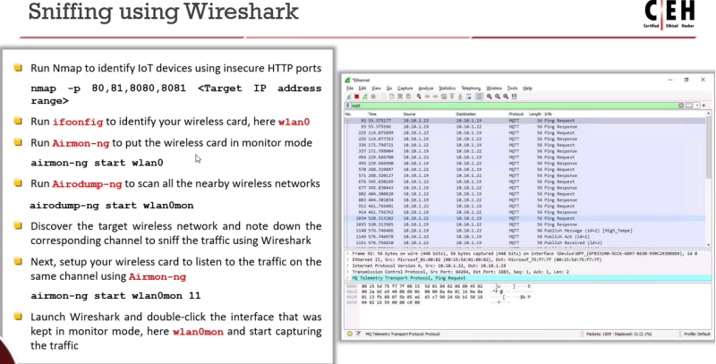
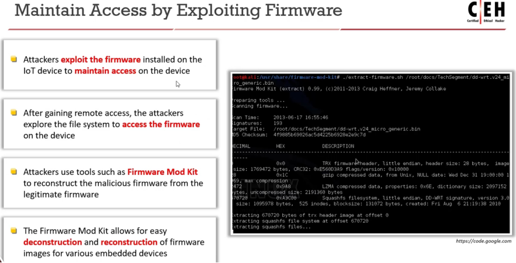

El objetivo de un hacker al explotar dispositivos IoT es obtener acceso no autorizado al dispositivo y a los datos del usuario. Un hacker puede utilizar dispositivos IoT comprometidos para formar un ejército de botnets, que a su vez se usa para lanzar un ataque DDoS.

**IoT Hacking Methodology**

**The following are the different phases in hacking an IoT device:**

**▪ Information Gathering**

En este paso, un atacante también identifica el diseño del hardware, su infraestructura y los componentes principales incrustados en el dispositivo objetivo que está presente en línea. Los atacantes hacen uso de herramientas como Shodan, Censys y FOFA para realizar la recopilación de información o reconocimiento sobre un dispositivo objetivo

Attackers can gather information on a target device using the filters given below:

▪ Search for webcams using geolocation

**webcamxp country:US** (Obtains all the webcamxp webcams present in US.)

▪ Search using city webcamxp city:

**paris (Obtains existing webcamxp webcams in paris.)**

▪ Find webcams using longitude and latitude webcamxp geo:

**-50.81,201.80 (Obtains a specific webcam present at the geolocation “-50.81,201.80” in the city Boston and country US.)**

▪ Net: Search based on the IP address or CIDR

▪ OS: Search based on the operating system used by the devices

▪ Port: Find all open ports

▪ Before/after: Provides result within a certain timeframe

Information Gathering using MultiPing
Source: https://www.multiping.com
An attacker can use the MultiPing tool to find the IP address of any IoT device in the target network

Information Gathering using FCC ID Search
Source: https://www.fcc.gov

**Information-Gathering Tools**

▪ Censys Source: https://censys.io
▪ FOFA Source: https://en.fofa.info  

**Information Gathering through Sniffing**

**nmap -p 80,81,8080,8081 \<Target IP address range\>**

**▪ Vulnerability Scanning**

El escaneo de vulnerabilidades permite a un atacante encontrar el número total de vulnerabilidades presentes en el firmware, la infraestructura y los componentes del sistema de un dispositivo IoT que son accesibles

**Vulnerability Scanning using IoTSeeker Source: https://github.com**

**perl iotScanner.pl <IP address/range of IP’s>**

**Vulnerability Scanning using Genzai**

**Source: https://github.com**

**./genzai <target_host> -save scan.json**

**Nmap**

**Attackers use the following Nmap command to scan a specific IP address:**

**nmap -n -Pn -sS -pT:0-65535 -v -A -oX \<Name\>\<IP\>**

**nmap -n -Pn -sSU -pT:0-65535,U:0-65535 -v -A -oX \<Name\>\<IP\>**  

**Vulnerability-Scanning Tools**

▪ beSTORM Source: https://www.beyondsecurity.com
▪ Metasploit (https://www.rapid7.com)
▪ IoTsploit (https://iotsploit.co)
▪ IoTSeeker (https://www.rapid7.com)
▪ IoTVAS (https://firmalyzer.com)
▪ Enterprise IoT Security (https://www.paloaltonetworks.com)

  
**▪ Launch Attacks**
Las vulnerabilidades encontradas luego se explotan para lanzar varios ataques, como ataques DDoS, ataques de código rodante, ataques de interferencia de señal, ataques Sybil, ataques de intermediario (MITM), y ataques de robo de datos e identidad.

**Rolling Code Attack using RFCrack Source: https://github.com**

▪ Live replay:
python RFCrack.py -i
▪ Rolling code:
python RFCrack.py -r -M MOD_2FSK -F 314350000
▪ Adjust RSSI range:
python RFCrack.py -r -M MOD_2FSK -F 314350000 -U -100 -L -10
▪ Jamming:
python RFCrack.py -j -F 314000000
▪ Scan common frequencies:
python RFCrack.py -k

**Exploiting Cameras using CamOver**

**Source: https://github.com**

**▪ Gain Remote Access**

Los atacantes realizan escaneos de puertos para conocer los puertos abiertos y los servicios en el dispositivo IoT objetivo. Si un atacante identifica que el puerto telnet está abierto, explota esta vulnerabilidad para obtener acceso remoto al dispositivo. Muchas aplicaciones de sistemas embebidos en dispositivos IoT, como sistemas de control industrial, routers, teléfonos VoIP y televisores, implementan capacidades de acceso remoto mediante telnet.

**▪ Maintain Access**

Una vez que el atacante obtiene acceso al dispositivo, utiliza diversas técnicas para mantener ese acceso y realizar una explotación continua. Los atacantes permanecen sin ser detectados al borrar los registros, actualizar el firmware y usar programas maliciosos como puertas traseras (backdoors), troyanos, etc., para mantener el acceso. Los atacantes emplean herramientas como Firmware Mod Kit, IoTVAS, Firmware Analysis Toolkit o Firmwalker para explotar el firmware.

**Firmware Mod Kit,**

El Firmware Mod Kit es un conjunto de herramientas, utilidades y scripts de shell. Las utilidades pueden usarse directamente, o los scripts pueden utilizarse para automatizar y combinar operaciones comunes con firmware (por ejemplo, extraer y reconstruir)

**IoT Hacking Tools**
▪ CatSniffer Source: https://github.com
▪ KillerBee (https://github.com)
▪ JTAGULATOR (https://www.grandideastudio.com)
▪ wiz_exploit (https://github.com)
▪ PENIOT (https://github.com)
▪ RouterSploit (https://github.com)

**IoT Security Tools**
▪ SeaCat.io Source: https://teskalabs.com
▪ Armis CentrixTM Source: https://www.armis.com
▪ FortiNAC (https://www.fortinet.com)
▪ Microsoft Defender for IoT (https://www.microsoft.com)
▪ Symantec Critical System Protection (https://www.broadcom.com)
▪ Cisco Industrial Threat Defense (https://www.cisco.com)
▪ AWS IoT Device Defender (https://aws.amazon.com)
▪ Forescout (https://www.forescout.com)
▪ NSFOCUS Anti-DDoS System (https://nsfocusglobal.com)
▪ Azure Sphere (https://www.microsoft.com)
▪ Overwatch (https://overwatchsec.com)
▪ Barbara (https://www.barbara.tech)
▪ Sternum (https://sternumiot.com)
▪ Asimily (https://asimily.com)
▪ ByteSweep (https://gitlab.com)
▪ Entrust IoT Security (https://www.entrust.com)
▪ IOT ASSET DISCOVERY (https://securolytics.io)